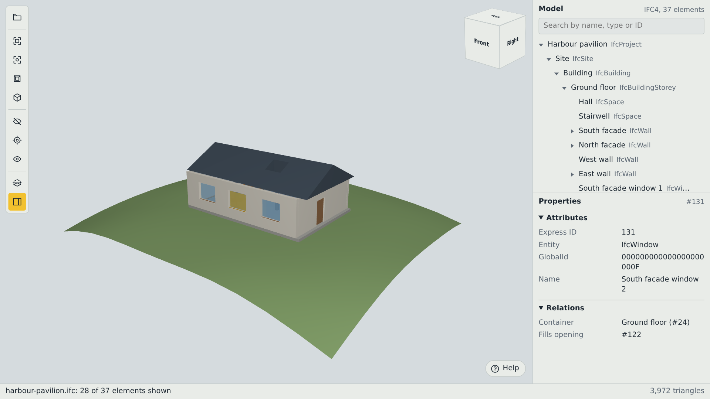
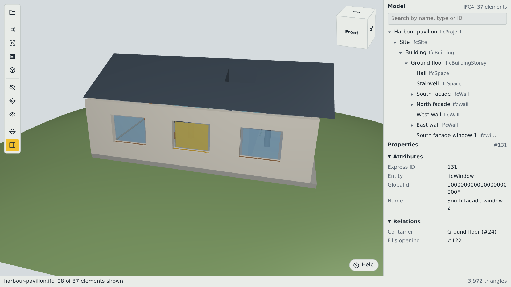
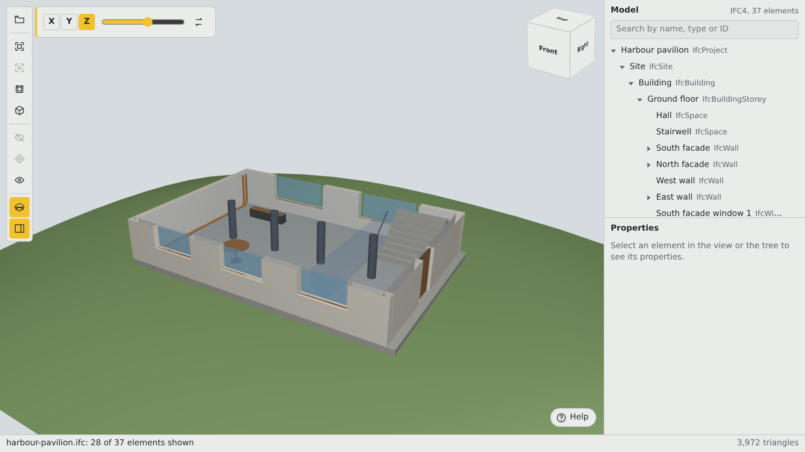
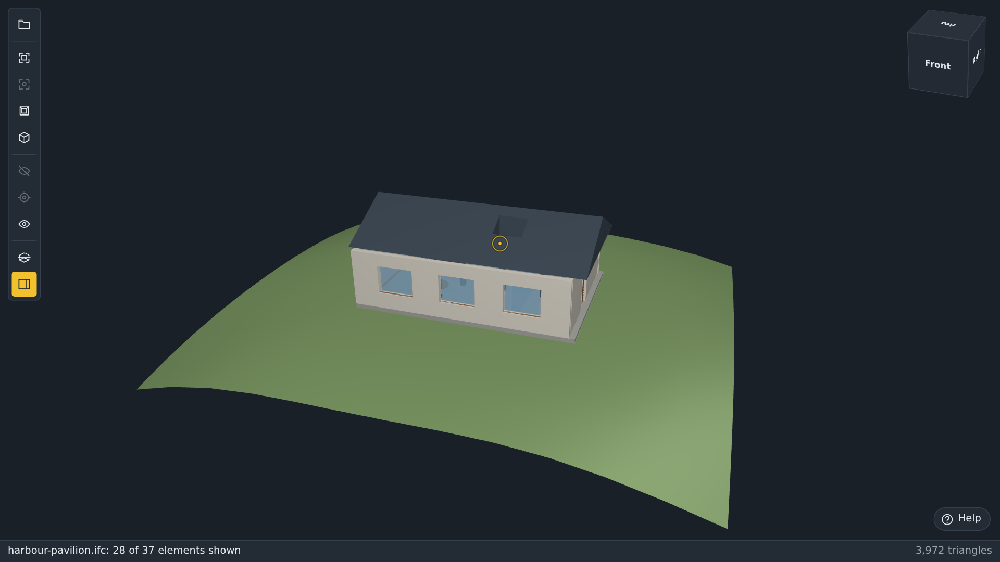
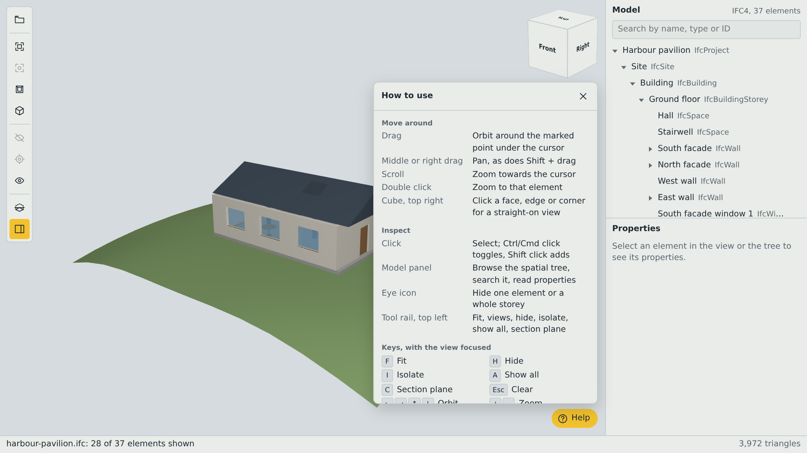
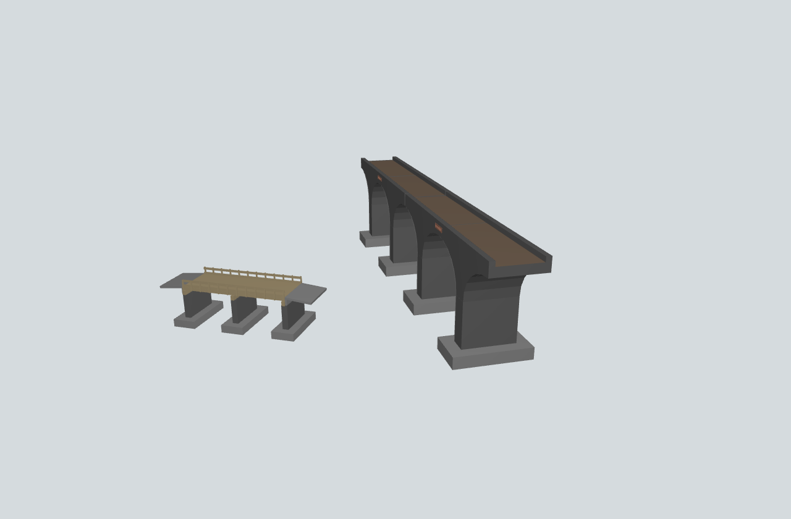
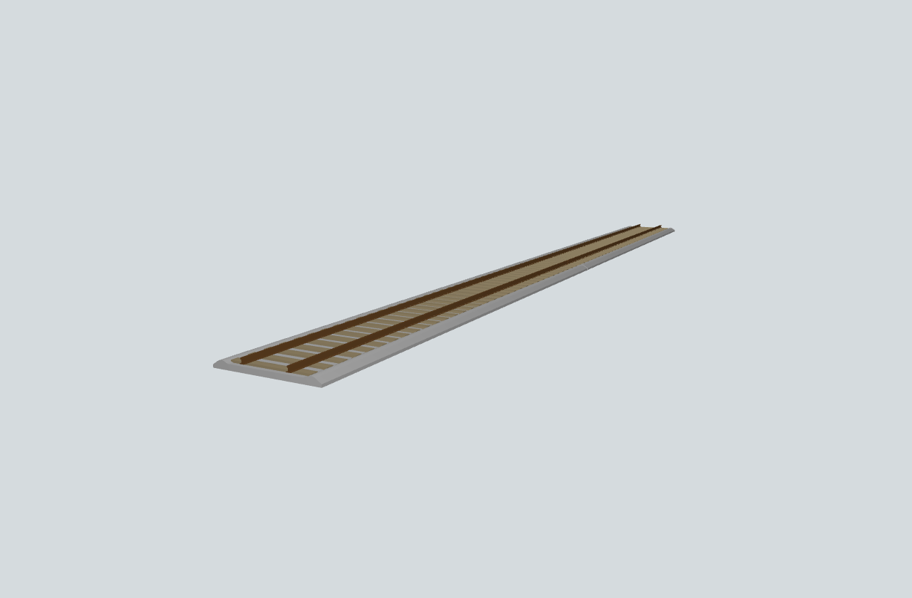
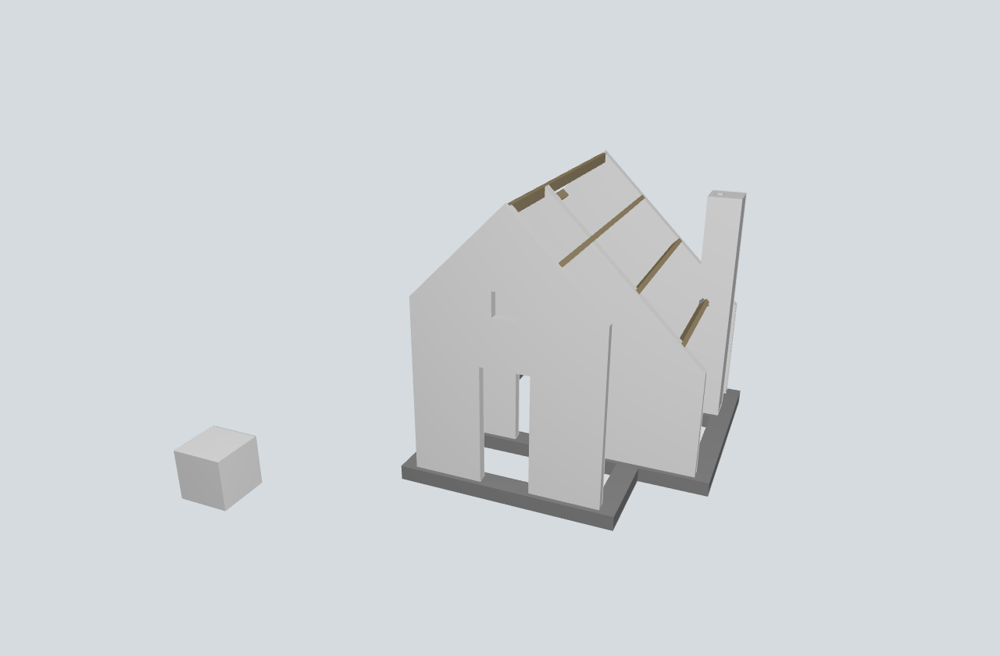
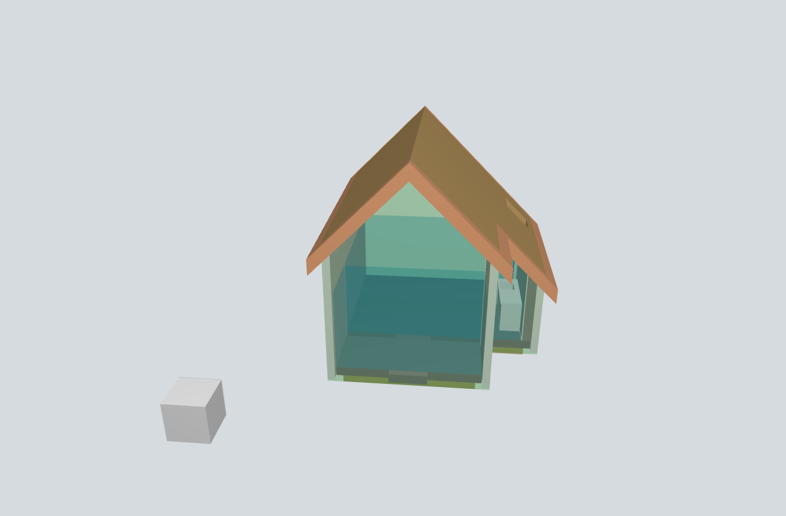

# ifc-lens

[](https://github.com/bask209/ifc-lens/actions/workflows/ci.yml)
[](LICENSE)

An embeddable IFC viewer for the browser, delivered as a `<ifc-viewer>` custom element.

- Opens IFC2X3, IFC4 and IFC4X3 STEP files (`.ifc`, `.ifczip`) from a URL, a `File`/`Blob` or an `ArrayBuffer`.
- Parses and builds geometry in a Web Worker. The UI thread only uploads finished GPU buffers.
- Covers extrusions, revolutions, sweeps, swept disks, mapped items (GPU instancing), triangulated and polygonal face sets, faceted and advanced BReps, Booleans with clipping and half-spaces, and semantic openings.
- Provides orbit/pan/zoom, an orientation cube, a built-in help panel, picking and selection, the spatial tree, a property inspector, hide/isolate/show all, section planes, progress and error reporting.
- Keeps everything inside Shadow DOM. It adds no global CSS or state, and multiple independent viewers can share a page.
- Has **zero runtime dependencies**. Every byte in `dist/` is compiled from this repository's Apache-2.0 source, and a provenance audit checks this on every build.
- Opens **every file of the buildingSMART Certification-datasets** in both the Node and the browser test suites ([results](docs/compatibility.md)).



## Quick start

```html
<script type="module" src="/ifc-viewer/ifc-viewer.js"></script>

<ifc-viewer src="/models/building.ifc" style="display:block;width:100%;height:600px"></ifc-viewer>
```

Install it from the repository (it builds itself on install), then serve the package's `dist/` directory as `/ifc-viewer/`:

```sh
npm install github:bask209/ifc-lens
cp -r node_modules/ifc-lens/dist public/ifc-viewer
```

The worker (`dist/worker/model-worker.js`) is resolved relative to the module, so keep the directory structure intact, or set the `worker-url` attribute.

Load local files or buffers programmatically:

```js
const viewer = document.querySelector("ifc-viewer");
input.addEventListener("change", () => viewer.load(input.files[0]));

viewer.addEventListener("ifc-selection-change", async (e) => {
  const [id] = e.detail.selectedIds;
  if (id !== undefined) console.log(await viewer.getProperties(id));
});

await viewer.load("/models/building.ifc");
viewer.select(18439, { fit: true });
viewer.isolate([18439]);
viewer.setClipPlane({ normal: [0, 0, 1], distance: 3.2 });
```

## A tour of the view


1. **Tool rail** — open a file, fit, fit the selection, top and isometric views, hide, isolate, show all, section plane, and the panel toggle.
2. **Orientation cube** — turns with the model. Click a face, edge or corner to swing the camera to any of the 26 standard views, keeping the current pivot and zoom. Its regions are ordinary buttons, so the keyboard and screen readers reach them too.
3. **Spatial tree** — project, site, building, storeys and their elements, with search by name, type or ID, and an eye icon to hide a single element or a whole storey.
4. **Properties** — attributes, relations, property and quantity sets, type properties, materials and classifications of the selection.
5. **Help** — the controls, in the view itself, so an embedded viewer explains itself. `?` opens and closes it.
6. **Status strip** — file name, how many elements are shown, the triangle count, and a progress bar while a model loads.

## Working with a model

| | |
|---|---|
|  |  |
| **Select and inspect.** Click an element — in the view or in the tree — and its properties appear beside it. Ctrl/Cmd click toggles, Shift click adds. | **Cut through it.** The section tool drops a plane on X, Y or Z, and the slider drives it through the model. `C` opens it, and the plane can also be set from code. |
|  |  |
| **Navigate.** Drag to orbit around the point under the cursor — a ring marks that anchor while you drag. Middle or right drag pans, the wheel zooms towards the cursor, and the whole UI follows the light or dark theme. | **Built-in help.** Everything above is listed in the panel behind the Help button: drag, pan, zoom, select, the cube, the tool rail, and `F` `H` `I` `A` `C` `?` `Esc`, arrows and `+`/`-`. |

## Every certification file opens

The [buildingSMART Certification-datasets](https://github.com/buildingSMART/Certification-datasets) run in both the Node and the browser suites on every build — all 35 files, three schema families, no skips and no expected failures ([results per file](docs/compatibility.md)).

| | |
|---|---|
|  |  |
| **IFC 4.3** Infra-Bridge | **IFC 4.3** Infra-Rail |
|  |  |
| **IFC 4** Building-Structural | **IFC 2x3** Building-Architecture |

Those four screenshots are of models from the Certification-datasets (© buildingSMART International, [CC BY 4.0](https://creativecommons.org/licenses/by/4.0/)), rendered by ifc-lens. The model files are fetched for testing and are not redistributed here.

## Navigation reference

| Input | Action |
|---|---|
| Drag | Orbit around the point under the cursor, marked by a ring while the drag lasts |
| Middle (wheel click) drag, right drag, Shift+drag | Pan |
| Wheel, pinch | Zoom towards the cursor |
| Click, double click | Select (Ctrl/Cmd toggles, Shift adds), zoom to that element |
| One finger, two fingers | Orbit, pinch-zoom and pan |
| `F` `H` `I` `A` `C` `?` `Esc`, arrows, `+`/`-` | Fit, hide, isolate, show all, section, help, clear, orbit, zoom (canvas focused) |

The spatial tree is fully keyboard navigable, and `viewer.viewFrom([1, -1, 1])` drives the camera from code.

## Documentation

| Document | Contents |
|---|---|
| [AGENTS.md](AGENTS.md) | Working on the repo: rules, commands, layer map, generated files |
| [docs/embedding.md](docs/embedding.md) | URL, File, Blob, ArrayBuffer, iframe embedding, theming, CSP |
| [docs/api.md](docs/api.md) | Public TypeScript interfaces, generated verbatim from the declarations |
| [docs/ifc-support.md](docs/ifc-support.md) | Support matrix per entity and schema family, with limitations |
| [docs/compatibility.md](docs/compatibility.md) | Certification-datasets results per file |
| [docs/architecture.md](docs/architecture.md) | Parser, model, geometry, CSG, worker, renderer, element |
| [docs/performance.md](docs/performance.md) | Benchmarks, memory model, tuning |
| [docs/security.md](docs/security.md) | Threat model, resource limits, CORS, iframe protocol |
| [docs/license-compliance.md](docs/license-compliance.md) | Runtime license policy, audit, SBOM |
| [docs/building.md](docs/building.md) | Build, test, demo and release commands |
| [CONTRIBUTING.md](CONTRIBUTING.md), [SECURITY.md](SECURITY.md) | Contributing and vulnerability reporting |
| [CHANGELOG.md](CHANGELOG.md) | Release notes |

Bugs, files that will not open and coverage requests belong in [GitHub issues](https://github.com/bask209/ifc-lens/issues); security reports follow [SECURITY.md](SECURITY.md).

## Try it

```sh
npm ci
npm run build
npm run serve          # http://127.0.0.1:8080/demo/
```

The demo opens the bundled *Harbour pavilion* model (`demo/models/harbour-pavilion.ifc`, generated by `npm run fixtures`, Apache-2.0). It also accepts a URL or a local file. The screenshots above are captured from that same page with `npm run docs:images`.

## Limitations

- IFC4X3 alignment-based geometry (`IfcGradientCurve`, `IfcSegmentedReferenceCurve`, clothoids, `IfcSectionedSolidHorizontal`) and `IfcLinearPlacement` without a Cartesian position are not evaluated. Affected items are reported as `GEOMETRY_UNSUPPORTED` / `PLACEMENT_INVALID` and the rest of the model loads.
- Advanced BRep faces on B-spline surfaces are tessellated over their full parameter domain (trimming curves are ignored). Other analytic surfaces fall back to their boundary polygon.
- Surface colours and transparency are supported; textures and text literals are not.
- Some profile details (flange slopes, edge radii) are simplified; see the support matrix.
- Georeferencing (`IfcMapConversion`) is not applied. Models display in their local engineering coordinates, with a floating render origin for precision.
- Rendering requires WebGL2, and the UI uses `color-mix()` and module workers: Chrome/Edge 111+, Firefox 114+, Safari 16.4+. `.ifczip` additionally needs `DecompressionStream`, which those versions provide.

## License

Apache License 2.0, see [LICENSE](LICENSE) and [NOTICE](NOTICE). The test corpus (buildingSMART Certification-datasets, CC BY 4.0) is downloaded for testing only and is not part of this repository or its packages.
