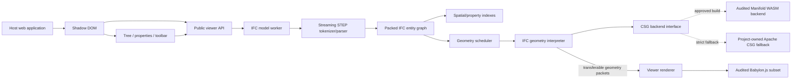
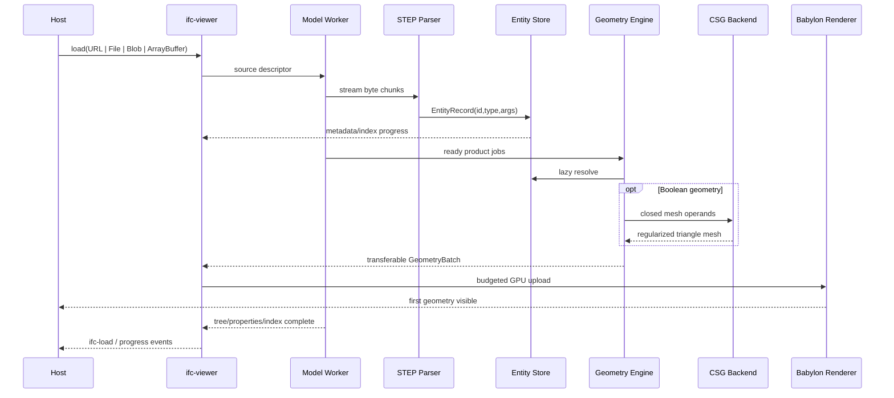

# Production Blueprint for an Apache-2.0-Only Embeddable IFC STEP Web Viewer

## Executive summary

A production-quality browser IFC viewer under the stated license policy is technically achievable, but the research uncovered an important qualification: **the preferred stack cannot simply be installed from npm and declared compliant**.

As of September 19, 2026, `@babylonjs/core` identifies itself as Apache-2.0 and version `9.27.1`, but its own package `NOTICE.md` says the package also contains `meshoptimizer`, which is MIT-licensed. The same NOTICE identifies Draco, Basis transcoder, GLSLang, and TWGSL as Apache-2.0. Consequently, shipping the entire `@babylonjs/core` package would fail a literal “every shipped runtime component is Apache-2.0” policy; an Apache-only viewer should instead import a deliberately small Babylon ESM subset, tree-shake it into the distributable, and verify by source-map/provenance audit that no MIT `meshoptimizer` code or other unapproved component reached the artifacts. citeturn24view1turn24view2turn1view0

Manifold itself is Apache-2.0, and its core CMake target has no mandatory external library dependency when optional parallelism, profiling, Python bindings, tests, and extras are disabled. Its current WASM npm package is also labeled Apache-2.0, but that npm package declares numerous dependencies unrelated to the minimal geometry core, so the whole package should not be shipped. More importantly for an unusually strict policy, Manifold's normal browser build uses Emscripten/Embind; Manifold's build files explicitly select Emscripten for its JS binding, while Emscripten states that `emcc` emits supporting JavaScript and that Emscripten is MIT/NCSA licensed, with bundled musl under MIT. Thus, **the stock generated Manifold JS/WASM artifact must be an explicit compliance gate rather than an assumed Apache-only artifact**. citeturn1view2turn17view0turn17view1turn17view2turn17view3turn19view0turn19view1

That gives the project two possible release policies:

| Runtime policy | Babylon strategy | Boolean/CSG strategy | Recommendation |
|---|---|---|---|
| **Literal Apache-only bytes/components** | Bundle only an audited Apache-only subset of Babylon modules | Approve a custom Manifold artifact only after artifact-level legal/provenance review; otherwise use an in-house Apache-2 CSG implementation | Safest interpretation of the requirement |
| **Apache-only source libraries; compiler runtime treated as build output** | Same audited Babylon subset | Custom minimal Manifold build can probably be accepted once compliance approves the interpretation | Much more practical |
| Whole npm packages accepted based only on top-level `license` | Whole `@babylonjs/core` and `manifold-3d` | Stock packages | **Do not use**; package contents/dependency manifests contradict the intended strictness |

This report therefore designs CSG behind a backend interface. The viewer remains fully usable without Manifold while the compliance question is resolved; the production v1 gate requires either an approved minimal Manifold artifact or completion of the project-owned fallback CSG backend.

The recommended runtime architecture is:



The parser should be a **streaming ISO 10303-21/STEP Physical File reader**, not a generated IFC object model. Official IFC examples use the familiar `ISO-10303-21; HEADER; ... DATA; #id=ENTITY(...); ... ENDSEC; END-ISO-10303-21;` organization, and buildingSMART's validation service separately checks STEP syntax and IFC schema validity. This makes a generic STEP graph plus a small version-aware IFC decoder layer a clean boundary. citeturn9search9turn23search4

The implementation should never replace `#123` references with JavaScript object pointers. Store references as numeric IDs and resolve them lazily through a central entity store. This naturally supports forward references, avoids recursively expanding cyclic graphs, enables packed representations for very large files, and permits IFC2x3 and IFC4 to share the same parser.

The geometry implementation order should be:

**placements → profiles → curves → extrusion → mapped representations → triangulated face sets → polygonal face sets → faceted BReps → Boolean/clipping results → swept disks**.

This follows both implementation dependency order and the IFC semantics. `IfcLocalPlacement` may be relative to another placement and applications are expected to prevent cycles; `IfcRepresentationMap`/`IfcMappedItem` exists specifically to reuse a representation under translation, rotation, scaling, or mirroring; IFC4 triangulated and polygonal face sets use one-based point indices and optionally indirect point maps; Boolean results apply regularized union/intersection/difference; and `IfcSweptDiskSolid` sweeps a circular disk along a 3D directrix. citeturn8view0turn8view1turn5search1turn5search2turn23search22turn7view1

The target production pipeline should be:



The most important design principle is to distinguish **format parsing**, **IFC semantic interpretation**, **geometric construction**, and **rendering**. Doing so makes the parser testable without a browser, keeps Babylon off the heavy worker path, lets Manifold be replaced without touching IFC code, and lets the public embedding API remain stable as geometry coverage expands.

A release called “production-ready” should mean **production-ready for a documented IFC2x3/IFC4 subset**, not “implements every entity in the IFC schema.” Unsupported representation items must produce structured diagnostics while the rest of the model continues loading. The supported-subset contract should be machine-readable and published with every release.

## Compliance architecture and repository design

The repository should be a TypeScript monorepo whose internal packages correspond to semantic boundaries rather than UI features. The final browser package should have **zero ordinary npm runtime dependencies**: Babylon modules that survive the license gate should be bundled into the artifact, and the approved CSG implementation should be shipped as a controlled sidecar. Dev dependencies may be unrestricted under the user's stated policy.

A recommended repository is:

```text
ifc-web-viewer/
├── LICENSE                         # Apache-2.0, project code
├── NOTICE
├── README.md
├── SECURITY.md
├── package.json
├── pnpm-workspace.yaml
├── tsconfig.base.json
├── rollup.config.mjs
│
├── packages/
│   ├── step-parser/
│   │   ├── src/
│   │   │   ├── byte-source.ts
│   │   │   ├── token.ts
│   │   │   ├── tokenizer.ts
│   │   │   ├── step-string.ts
│   │   │   ├── value-parser.ts
│   │   │   ├── physical-file-parser.ts
│   │   │   ├── diagnostics.ts
│   │   │   └── index.ts
│   │   └── package.json
│   │
│   ├── ifc-model/
│   │   ├── src/
│   │   │   ├── entity-store.ts
│   │   │   ├── packed-value-arena.ts
│   │   │   ├── resolver.ts
│   │   │   ├── decoder-registry.ts
│   │   │   ├── ifc2x3-decoders.ts
│   │   │   ├── ifc4-decoders.ts
│   │   │   ├── product-index.ts
│   │   │   ├── spatial-index.ts
│   │   │   ├── relationships.ts
│   │   │   ├── properties.ts
│   │   │   ├── units.ts
│   │   │   ├── representations.ts
│   │   │   └── index.ts
│   │   └── package.json
│   │
│   ├── math/
│   │   └── src/
│   │       ├── vec2.ts
│   │       ├── vec3.ts
│   │       ├── mat4.ts
│   │       ├── predicates.ts
│   │       ├── bounds.ts
│   │       └── tolerance.ts
│   │
│   ├── triangulation/
│   │   └── src/
│   │       ├── polygon-cleanup.ts
│   │       ├── hole-bridge.ts
│   │       ├── ear-clip.ts
│   │       ├── monotone-fallback.ts
│   │       └── index.ts
│   │
│   ├── ifc-geometry/
│   │   ├── src/
│   │   │   ├── engine.ts
│   │   │   ├── geometry-types.ts
│   │   │   ├── placements.ts
│   │   │   ├── profiles.ts
│   │   │   ├── curves.ts
│   │   │   ├── extrusion.ts
│   │   │   ├── mapped-items.ts
│   │   │   ├── triangulated-face-set.ts
│   │   │   ├── polygonal-face-set.ts
│   │   │   ├── faceted-brep.ts
│   │   │   ├── booleans.ts
│   │   │   ├── half-spaces.ts
│   │   │   ├── openings.ts
│   │   │   ├── swept-disk.ts
│   │   │   ├── normals.ts
│   │   │   ├── mesh-repair.ts
│   │   │   └── scheduler.ts
│   │   └── package.json
│   │
│   ├── csg-api/
│   │   └── src/
│   │       └── csg-backend.ts
│   │
│   ├── csg-manifold/
│   │   ├── src/
│   │   │   ├── loader.ts
│   │   │   ├── manifold-backend.ts
│   │   │   ├── conversion.ts
│   │   │   └── ownership.ts
│   │   ├── native/
│   │   │   └── bridge.cpp
│   │   └── package.json
│   │
│   ├── csg-native/
│   │   └── src/
│   │       ├── bvh.ts
│   │       ├── intersections.ts
│   │       ├── fragment-split.ts
│   │       ├── classification.ts
│   │       ├── stitching.ts
│   │       └── backend.ts
│   │
│   ├── worker-protocol/
│   │   └── src/
│   │       ├── messages.ts
│   │       └── transfer.ts
│   │
│   ├── model-worker/
│   │   └── src/
│   │       ├── worker.ts
│   │       ├── load-session.ts
│   │       ├── source-reader.ts
│   │       └── resource-budget.ts
│   │
│   ├── viewer-core/
│   │   └── src/
│   │       ├── viewer.ts
│   │       ├── babylon-runtime.ts
│   │       ├── mesh-registry.ts
│   │       ├── instance-registry.ts
│   │       ├── upload-queue.ts
│   │       ├── picking.ts
│   │       ├── selection.ts
│   │       ├── visibility.ts
│   │       ├── clipping.ts
│   │       ├── camera.ts
│   │       ├── render-origin.ts
│   │       └── product-bvh.ts
│   │
│   ├── web-component/
│   │   └── src/
│   │       ├── ifc-viewer-element.ts
│   │       ├── shadow-template.ts
│   │       ├── styles.ts
│   │       ├── toolbar.ts
│   │       ├── spatial-tree-view.ts
│   │       ├── properties-view.ts
│   │       └── events.ts
│   │
│   └── iframe-bridge/
│       └── src/
│           ├── protocol.ts
│           ├── iframe-client.ts
│           └── iframe-host.ts
│
├── tests/
│   ├── fixtures/
│   │   ├── generated/
│   │   └── external-manifest/
│   ├── parser/
│   ├── model/
│   ├── geometry/
│   ├── integration/
│   ├── security/
│   ├── visual/
│   ├── performance/
│   └── license/
│
├── examples/
│   ├── minimal/
│   ├── programmatic/
│   ├── local-file/
│   ├── iframe/
│   ├── custom-ui/
│   └── large-model/
│
├── scripts/
│   ├── audit-runtime-licenses.mjs
│   ├── audit-sourcemaps.mjs
│   ├── audit-wasm.mjs
│   ├── generate-sbom.mjs
│   ├── generate-third-party-notice.mjs
│   ├── generate-test-ifc.mjs
│   └── benchmark-report.mjs
│
└── docs/
    ├── architecture.md
    ├── embedding.md
    ├── api.md
    ├── ifc-support.md
    ├── performance.md
    ├── security.md
    ├── building.md
    └── license-compliance.md
```

**Package-boundary rule:** `step-parser` knows STEP but nothing about IFC geometry; `ifc-model` knows IFC entities/relationships but no Babylon classes; `ifc-geometry` receives IFC model views and produces renderer-neutral triangle packets; `viewer-core` receives only those packets; the custom element depends on the viewer but the viewer never depends on the custom element.

Do not use Babylon `Vector3` or `Matrix` in the parser or geometry worker. Use project-owned `Float64` math. This avoids pulling rendering code into workers, makes numerical tests independent of Babylon conventions, and keeps an exact license boundary around the renderer.

**Runtime license boundary.** Babylon's top-level license is Apache-2.0, and the core package's manifest also declares Apache-2.0, but its NOTICE explicitly records MIT `meshoptimizer`. Therefore import precise modules rather than the root barrel and make final-artifact provenance, not `package.json`, the source of truth. citeturn1view0turn24view1turn24view2

A renderer module should look conceptually like:

```ts
// Do not import from "@babylonjs/core" barrel.
import { Engine } from "@babylonjs/core/Engines/engine.js";
import { Scene } from "@babylonjs/core/scene.js";
import { ArcRotateCamera } from "@babylonjs/core/Cameras/arcRotateCamera.js";
import { Mesh } from "@babylonjs/core/Meshes/mesh.js";
import { VertexData } from "@babylonjs/core/Meshes/mesh.vertexData.js";
import { StandardMaterial } from "@babylonjs/core/Materials/standardMaterial.js";
import { Color3 } from "@babylonjs/core/Maths/math.color.js";
```

The exact import closure must be frozen in a generated manifest:

```json
{
  "approvedOrigins": [
    "packages/project/**",
    "node_modules/@babylonjs/core/Engines/**",
    "node_modules/@babylonjs/core/Cameras/**",
    "node_modules/@babylonjs/core/Maths/**",
    "node_modules/@babylonjs/core/Meshes/**",
    "node_modules/@babylonjs/core/Materials/**"
  ],
  "forbiddenOrigins": [
    "**/meshoptimizer/**"
  ]
}
```

Do not assume that the directory-level whitelist above is permanently sufficient. The audit script must inspect the actual source-map `sources` entries generated by each pinned Babylon version and fail on every origin not explicitly classified.

**Manifold boundary.** Manifold's core library source is Apache-2.0, and its CMake target links only optional TBB when parallel mode is enabled. The recommended minimal source build therefore disables parallelism, testing, Python bindings, extras, tracing, and dependency downloads. citeturn17view0turn17view1turn18view0

Conceptually:

```text
MANIFOLD_PAR=OFF
MANIFOLD_TEST=OFF
MANIFOLD_PYBIND=OFF
MANIFOLD_NO_IOSTREAM=ON
TRACY_ENABLE=OFF
ASSIMP_ENABLE=OFF
MANIFOLD_DOWNLOADS=OFF
```

Do **not** make `manifold-3d` an ordinary production dependency. Its current npm package lists a collection of runtime and peer dependencies, including glTF-transform packages and several utility packages, even though the C++ core itself does not need those for basic booleans. citeturn17view3turn18view0

The current upstream WASM binding uses Emscripten's `--bind`/Embind and ES-module generation. Emscripten itself documents that `emcc` emits JavaScript API-support code and its license file identifies MIT/NCSA licensing and MIT musl content. For the user's literal policy, this requires a compliance decision on the generated artifact rather than merely on Manifold's source repository. citeturn17view2turn19view0turn19view1

Create this interface regardless:

```ts
export type CsgOperation = "union" | "intersection" | "difference";

export interface TriangleMesh64 {
  positions: Float64Array; // xyzxyz...
  indices: Uint32Array;    // triangle triplets
}

export interface CsgSolid {
  readonly backend: symbol;
  readonly handle: number;
}

export interface CsgBackend {
  initialize(signal?: AbortSignal): Promise<void>;

  create(mesh: TriangleMesh64): CsgSolid;

  apply(
    operation: CsgOperation,
    first: CsgSolid,
    second: CsgSolid,
  ): CsgSolid;

  transform(solid: CsgSolid, matrix: Float64Array): CsgSolid;

  exportMesh(solid: CsgSolid): TriangleMesh64;

  dispose(solid: CsgSolid): void;

  disposeAll(): void;
}
```

The Manifold typings explicitly describe Boolean operations, mesh creation, extrusion and transformation APIs, and warn that objects backed by WASM memory must be explicitly deleted because JavaScript garbage collection does not automatically reclaim that memory. Your adapter must therefore enforce deterministic ownership with `try/finally`; relying on GC is a correctness bug for large models. citeturn2view1

Use this pattern:

```ts
const a = backend.create(meshA);
const b = backend.create(meshB);

let result: CsgSolid | undefined;

try {
  result = backend.apply("difference", a, b);
  return backend.exportMesh(result);
} finally {
  if (result) backend.dispose(result);
  backend.dispose(b);
  backend.dispose(a);
}
```

The official IFC specification itself is reference material, not an Apache runtime library. Current buildingSMART IFC pages identify their specification material under Creative Commons licensing, so under this project's particularly strict distribution policy, do not copy EXPRESS schemas, HTML documentation, or schema-generated data tables into the browser package. Maintain small, original TypeScript decoders for the fields the viewer uses. citeturn6search0turn8view1

A final npm package should consequently resemble:

```json
{
  "name": "@your-org/ifc-viewer",
  "version": "1.0.0",
  "type": "module",
  "files": [
    "dist/",
    "LICENSE",
    "NOTICE",
    "THIRD_PARTY_LICENSES/"
  ],
  "exports": {
    ".": {
      "types": "./dist/index.d.ts",
      "import": "./dist/ifc-viewer.js"
    },
    "./iframe": "./dist/iframe/index.html"
  },
  "dependencies": {}
}
```

The key property is `"dependencies": {}` in the **published runtime package**. Babylon is a build input whose approved pieces are embedded; Manifold, if approved, is a sidecar whose provenance is controlled by the project. Dev tools remain ordinary dev dependencies.

Apache-2.0 redistribution requires preservation of the license and applicable NOTICE information, so generate a distribution-level NOTICE and retain Babylon/Manifold notices for every component actually present in the binary. citeturn1view0turn24view0

## STEP parser, entity graph, semantics, and memory model

The STEP layer should be deliberately small and schema-independent. An IFC SPF example published by buildingSMART demonstrates the expected Part-21 envelope and numbered entity statements, while buildingSMART's own validation service treats STEP syntax and IFC schema conformance as distinct validation layers. That separation is exactly what the viewer architecture should reproduce. citeturn9search9turn23search4

**Tokenizer design.** Parse bytes, not one giant JavaScript string. IFC syntax is ASCII-oriented, and byte parsing avoids allocating a second UTF-16 copy of a 100–500 MB file. Strings should be decoded only when a complete STEP string literal has been recognized.

Use these tokens:

```ts
export const enum StepTokenKind {
  HashId,        // #123
  Identifier,    // IFCWALL
  Integer,       // 17
  Real,          // 1.23, -1.4E+3
  String,        // 'text'
  Enumeration,   // .WALL., .T.
  Binary,        // "0101..."
  Dollar,        // $
  Asterisk,      // *
  OpenParen,     // (
  CloseParen,    // )
  Comma,         // ,
  Equals,        // =
  Semicolon,     // ;
  End,
}

export interface StepToken {
  kind: StepTokenKind;
  startOffset: number;
  endOffset: number;
  id?: number;
  numberValue?: number;
  text?: string;
}
```

The streaming tokenizer is a state machine:

```ts
const enum LexState {
  Normal,
  Identifier,
  Number,
  String,
  Binary,
  Comment,
}
```

Its contract:

```ts
export interface TokenizerLimits {
  maxTokenBytes: number;
  maxStringBytes: number;
}

export class StepTokenizer {
  constructor(limits: TokenizerLimits);

  push(
    chunk: Uint8Array,
    final: boolean,
    emit: (token: StepToken) => void,
  ): void;

  reset(): void;
}
```

Every lexical state must survive chunk boundaries. Tests must deliberately split input at every possible byte position, including:

```text
#12
3=IFCWA
LL('A''B',
\X2\00
E900
F1\X0\);
```

The parser must recognize at least these value categories:

```ts
export type StepValue =
  | { kind: "null" }                       // $
  | { kind: "derived" }                    // *
  | { kind: "integer"; value: number }
  | { kind: "real"; value: number }
  | { kind: "string"; value: string }
  | { kind: "enum"; value: string }
  | { kind: "ref"; id: number }
  | { kind: "list"; values: StepValue[] }
  | { kind: "typed"; type: string; args: StepValue[] }
  | { kind: "binary"; value: Uint8Array };
```

Do not interpret `.T.`, `.F.`, `.U.` at the lexer layer. They are syntactically enumerations; schema-aware decoders can expose them as logical values later.

STEP strings need a dedicated decoder. Implement doubled apostrophes and the Part-21 encoded-character mechanisms needed by real IFC2x3/IFC4 files, including the common `\X\`, `\X2\...\X0\`, `\X4\...\X0\`, and legacy page/shift forms. Keep this logic out of the lexer so malformed escape sequences can generate precise diagnostics rather than corrupting token synchronization.

The parser should be **iterative**, not recursively call itself for nested aggregates. Maintain an explicit frame stack:

```ts
interface AggregateFrame {
  kind: "list" | "typed";
  type?: string;
  values: StepValue[];
}
```

Set a configurable nesting limit to prevent malicious input from causing stack or memory exhaustion.

The top-level parser API should be:

```ts
export interface StepHeader {
  fileDescription?: string[];
  fileName?: string;
  schemaIdentifiers: string[];
}

export interface EntityRecord {
  readonly id: number;
  readonly typeId: number;
  readonly args: readonly StepValue[];
  readonly byteStart: number;
  readonly byteEnd: number;
}

export interface StepParseEventMap {
  header: StepHeader;
  entity: EntityRecord;
  diagnostic: StepDiagnostic;
  end: { entityCount: number; bytesRead: number };
}

export async function parseStepStream(
  stream: ReadableStream<Uint8Array>,
  sink: StepParseSink,
  options: StepParseOptions,
): Promise<void>;
```

A parsing state transition for a simple entity is:

```text
#123
  ↓
expect '='
  ↓
IFCWALL
  ↓
'('
  ↓
parse values using aggregate-frame stack
  ↓
')'
  ↓
';'
  ↓
emit EntityRecord
```

Never wait for references to resolve during parsing. A valid IFC entity can reference a later `#id`.

**Entity storage.** Start with a simple facade, but make the production internal representation packed.

The external conceptual model is:

```ts
export interface IfcEntity {
  id: number;
  type: string;
  args: readonly StepValue[];
}

export class IfcModel {
  readonly entities: ReadonlyMap<number, IfcEntity>;

  get(id: number): IfcEntity | undefined;
  require(id: number): IfcEntity;
}
```

The production implementation should instead map STEP IDs to compact record indices:

```ts
type EntityIndex = number;

export interface PackedEntityStore {
  readonly idToIndex: Map<number, EntityIndex>;

  entityIds: Uint32Array;
  typeIds: Uint32Array;
  valueOffsets: Uint32Array;
  valueCounts: Uint32Array;

  getById(id: number): EntityView | undefined;
  getByIndex(index: EntityIndex): EntityView;
}
```

Use a value arena:

```ts
const enum PackedValueTag {
  Null,
  Derived,
  Integer,
  Real,
  String,
  Enum,
  Ref,
  List,
  Typed,
  Binary,
}

interface PackedValueArena {
  tags: Uint8Array;

  // Tag-specific payload or offset.
  payload32: Uint32Array;

  // Numeric pool.
  numbers: Float64Array;

  // Aggregate ranges.
  childOffset: Uint32Array;
  childCount: Uint32Array;
}
```

This prevents a million-entity model from becoming millions of deeply nested JavaScript objects. The ergonomic `EntityView` can materialize values lazily.

Intern type names:

```text
"IFCWALL" -> 17
"IFCLOCALPLACEMENT" -> 28
"IFCCARTESIANPOINT" -> 43
```

and store the integer in every entity record. Property text should not automatically be interned because most property values are unique; entity/type/attribute names are ideal candidates.

**Lazy reference resolution** should be nothing more complicated than an ID lookup:

```ts
export class EntityResolver {
  constructor(private readonly store: PackedEntityStore) {}

  ref(value: StepValue): EntityView | undefined {
    return value.kind === "ref"
      ? this.store.getById(value.id)
      : undefined;
  }

  requireRef(value: StepValue, context: string): EntityView {
    if (value.kind !== "ref") {
      throw new IfcDecodeError(`${context}: expected STEP reference`);
    }

    const entity = this.store.getById(value.id);

    if (!entity) {
      throw new IfcDecodeError(
        `${context}: unresolved reference #${value.id}`,
      );
    }

    return entity;
  }
}
```

Do not mutate:

```ts
{ kind: "ref", id: 319 }
```

into:

```ts
{ kind: "ref", entity: someHugeObject }
```

That creates retained cycles, duplicates graph edges in memory, complicates worker serialization, and makes malformed cyclic IFC relationships dangerous.

Every recursive semantic traversal uses a guard:

```ts
export interface TraversalGuard {
  active: Set<number>;
  depth: number;
  maxDepth: number;
}

function enter(id: number, guard: TraversalGuard): void {
  if (guard.depth >= guard.maxDepth) {
    throw new IfcResourceLimitError("reference depth");
  }

  if (guard.active.has(id)) {
    throw new IfcCycleError(id);
  }

  guard.active.add(id);
  guard.depth++;
}
```

This is particularly important for placements and nested mapped items. The official `IfcLocalPlacement` definition explicitly allows relative placement chains and says applications must prevent placement cycles. citeturn8view0

**Schema tolerance.** Detect the schema identifier from `FILE_SCHEMA`, normalize aliases such as `IFC4X3...` into a schema family, and select a tiny decoder registry:

```ts
export type IfcSchemaFamily =
  | "IFC2X3"
  | "IFC4"
  | "IFC4X3"
  | "UNKNOWN";

export interface DecodeContext {
  schema: IfcSchemaFamily;
  resolver: EntityResolver;
  units: UnitContext;
}

export interface EntityDecoder<T> {
  readonly type: string;
  readonly schemas: readonly IfcSchemaFamily[];

  decode(
    entity: EntityView,
    context: DecodeContext,
  ): T;
}
```

The parser still retains every unknown entity. “Unsupported” means “not semantically decoded,” not “discarded.”

Do not generate thousands of TypeScript IFC classes. Implement only:

1. common `IfcRoot`/`IfcObject`/`IfcProduct` fields needed for labels and product geometry;
2. spatial relationship entities;
3. property relationships;
4. unit/context entities;
5. the representation/geometry entities in scope.

That small metadata surface should be hand-maintained for IFC2x3 and IFC4 families and covered by fixture tests.

**Product and representation discovery.** For each `IfcProduct`, resolve its `ObjectPlacement` and `Representation`. From `IfcProductDefinitionShape`, select representations with `RepresentationIdentifier = "Body"` first. Treat `Axis`, `Box`, annotation, and other representations as non-body unless a caller requests them. If no `Body` representation is present, choose the first supported geometric representation and log a warning.

Represent the result as a recipe before triangulation:

```ts
export interface ProductGeometryRecipe {
  productId: number;
  placementId?: number;
  contextId?: number;
  representations: RepresentationRecipe[];
}

export interface RepresentationRecipe {
  representationId: number;
  identifier?: string;
  representationType?: string;
  itemIds: Uint32Array;
}
```

This intermediate representation is an important performance boundary: the parser/model worker can prioritize and schedule geometry without repeatedly walking IFC relationship graphs.

**Spatial tree.** Build adjacency indexes from decomposition and containment relationships rather than following arbitrary references. The tree should conceptually be:

```text
IfcProject
  └─ IfcSite
      └─ IfcBuilding
          └─ IfcBuildingStorey
              ├─ IfcWall
              ├─ IfcDoor
              └─ IfcSlab
```

Use:

```ts
interface SpatialTreeIndex {
  aggregateChildren: Map<number, Uint32Array>;
  aggregateParent: Map<number, number>;
  containedProducts: Map<number, Uint32Array>;
  containmentParent: Map<number, number>;
}
```

Malformed/uncontained products go under a synthetic “Unassigned” node instead of disappearing.

**Properties.** Build reverse relationship indexes once:

```ts
interface PropertyIndexes {
  propertySetsByObject: Map<number, Uint32Array>;
  typesByObject: Map<number, Uint32Array>;
  quantitiesByObject: Map<number, Uint32Array>;
}
```

The UI requests properties lazily:

```ts
export interface PropertyValue {
  name: string;
  value: string | number | boolean | null;
  unit?: string;
}

export interface PropertyGroup {
  name: string;
  sourceId: number;
  properties: PropertyValue[];
}

export function getPropertyGroups(
  model: IfcModel,
  productId: number,
): PropertyGroup[];
```

Never stringify the entire entity graph for the properties panel.

**Units.** Resolve `IfcProject.UnitsInContext` early. Geometry should use one internal length convention, preferably metres, while the property UI retains source-unit formatting. Directions remain dimensionless. Tolerances should be expressed in model-space metres after conversion.

Store:

```ts
export interface UnitContext {
  lengthToMetres: number;
  angleToRadians: number;
  areaToSquareMetres: number;
  volumeToCubicMetres: number;
}
```

**Streaming strategy.** For a URL, let the worker perform `fetch()` and consume `response.body`; for `Blob`/`File`, send the object to the worker and use its stream; for an `ArrayBuffer`, transfer ownership. Worker `postMessage` supports structured-clone data and transferable ownership, and transferred `ArrayBuffer`s cease to be usable by the sending side, making them suitable for geometry packet transfer without byte-for-byte copying. citeturn22view0turn21search20

A load source API:

```ts
export type IfcSource =
  | string
  | URL
  | Blob
  | File
  | ArrayBuffer
  | Uint8Array;

export interface LoadOptions {
  signal?: AbortSignal;

  credentials?: RequestCredentials;

  maxFileBytes?: number;
  maxEntities?: number;
  maxTriangles?: number;
  maxGeometryBytes?: number;
  maxStringBytes?: number;
  maxAggregateDepth?: number;
  maxReferenceDepth?: number;
  maxBooleanDepth?: number;
}
```

Do not initially generate geometry truly concurrently with the first few parsed references; arbitrary forward references make naïve readiness testing unreliable. The safe MVP sequence is **stream parse → complete entity index → geometry** while still avoiding a giant source string. v1 can add speculative/incremental jobs:

```ts
type GeometryAttempt =
  | { status: "ready"; packet: GeometryPacket }
  | { status: "waiting"; missingIds: Uint32Array }
  | { status: "unsupported"; reason: string }
  | { status: "error"; diagnostic: GeometryDiagnostic };
```

Maintain:

```ts
Map<number /* missing entity id */, Set<JobId>>
```

When a referenced entity arrives, requeue only jobs waiting on it. Cap retries and dependency depth.

This allows direct tessellated geometry to appear before expensive booleans in genuinely large models without making parser correctness depend on entity ordering.

## Geometry algorithms and IFC coverage

The geometry engine should consume IFC IDs and return renderer-independent indexed meshes plus instances. IFC semantics should not leak into Babylon objects.

Use:

```ts
export interface Bounds3 {
  minX: number;
  minY: number;
  minZ: number;
  maxX: number;
  maxY: number;
  maxZ: number;
}

export interface GeometryData {
  positions: Float32Array;
  normals: Float32Array;
  indices: Uint32Array;

  bounds: Bounds3;
}

export interface GeometryDefinition {
  key: string;
  geometry: GeometryData;
  materialKey: string;
}

export interface GeometryInstance {
  productId: number;
  definitionKey: string;

  // Logical column-vector affine transform;
  // converted explicitly at Babylon boundary.
  transform: Float64Array;
}

export interface GeometryBatch {
  definitions: GeometryDefinition[];
  instances: GeometryInstance[];
}
```

Keep all construction and placement math in `Float64Array`. Convert vertex data to `Float32Array` only after subtracting a local render origin. This matters for georeferenced BIM data where large world coordinates can overwhelm 32-bit GPU coordinate precision.

### Geometry implementation matrix

| IFC feature | Target | Complexity | Core algorithm | Runtime dependency |
|---|---:|---:|---|---|
| `IfcLocalPlacement`, `IfcAxis2Placement2D/3D` | MVP | Medium | Cached affine transform chains; Gram-Schmidt basis construction; cycle detection | Project math only. Semantics: citeturn8view0turn6search0 |
| Rectangle/circle/arbitrary profiles | MVP | Medium | Normalize 2D loops, profile-local placement, adaptive circle tessellation | Project geometry only |
| `IfcPolyline`, initial indexed curves | MVP | Medium | Point extraction; line/arc adaptive tessellation | Project geometry only |
| `IfcExtrudedAreaSolid` | MVP | Medium-high | Cap triangulation plus side-wall construction along arbitrary extrusion vector | Project triangulator. IFC semantics: citeturn5search0 |
| `IfcMappedItem` / `IfcRepresentationMap` | MVP | High | Base geometry cache + mapping transform + instancing | Project math + renderer instancing. IFC semantics: citeturn8view1 |
| `IfcTriangulatedFaceSet` | MVP | Medium | Validate/remap one-based indices; preserve or generate normals | No CSG. IFC semantics: citeturn5search1 |
| `IfcPolygonalFaceSet` | v1 | High | Project planar polygons, holes, constrained triangulation fallback | Project triangulator. IFC semantics: citeturn5search2 |
| `IfcFacetedBrep` | v1 | High | Closed shell traversal; planar face triangulation; orientation validation | Project triangulator |
| `IfcBooleanResult` | v1 | Very high | Transform operands to common frame; regularized union/intersection/difference | `CsgBackend`; semantics: citeturn23search22 |
| `IfcBooleanClippingResult` | v1 | Very high | Difference plus half-space support | `CsgBackend`; clipping semantics: citeturn23search6 |
| `IfcSweptDiskSolid` | v1 | Very high | Adaptive directrix tessellation + rotation-minimizing frames + mitered joins | Project geometry; semantics: citeturn7view1 |
| Additional B-spline/composite curves and solids | v2 | Very high | Curve evaluators, knot/span handling, adaptive tessellation | Project code |
| Semantic opening subtraction | v1 | Very high | Relational host/opening geometry → CSG subtraction | `CsgBackend` |

**Placements.** `IfcAxis2Placement3D` defines an origin, local Z axis and local X reference direction; Y is derived, and defaults are available when optional directions are absent. buildingSMART also notes that the supplied directions need not already be orthogonal, so the implementation must orthogonalize them. citeturn6search0

Use column-vector math in the geometry engine:

\[
M =
\begin{bmatrix}
x_x & y_x & z_x & o_x\\
x_y & y_y & z_y & o_y\\
x_z & y_z & z_z & o_z\\
0 & 0 & 0 & 1
\end{bmatrix}
\]

Algorithm:

```ts
function axis2Placement3D(
  origin: Vec3,
  axis?: Vec3,
  refDirection?: Vec3,
): Mat4 {
  const z = normalize(axis ?? [0, 0, 1]);

  const suppliedX = normalize(refDirection ?? [1, 0, 0]);

  // Orthogonalize X against Z.
  let x = sub(
    suppliedX,
    scale(z, dot(suppliedX, z)),
  );

  if (lengthSquared(x) < EPS2) {
    // Malformed input: choose the global axis least aligned with Z.
    const fallback = leastAlignedAxis(z);
    x = sub(fallback, scale(z, dot(fallback, z)));
  }

  x = normalize(x);

  const y = normalize(cross(z, x));

  return mat4FromBasis(x, y, z, origin);
}
```

For a local placement:

```ts
function worldPlacement(id: number): Mat4 {
  const cached = placementCache.get(id);
  if (cached) return cached;

  const p = decodeLocalPlacement(id);

  const relative = decodeAxisPlacement(p.relativePlacement);

  const world =
    p.placementRelTo === undefined
      ? relative
      : multiply(worldPlacement(p.placementRelTo), relative);

  placementCache.set(id, world);
  return world;
}
```

The IFC definition says omitted `PlacementRelTo` makes the placement absolute, and relative chains must not be cyclic. citeturn8view0

`IfcAxis2Placement2D` is:

```text
x = normalized RefDirection or (1,0)
y = (-x.y, x.x)
z = (0,0,1)
```

Embed it in the 3D profile plane.

**Representation contexts.** Preserve the model's geometric representation context transform separately from product placement:

```text
M_world =
    M_context
  × M_productPlacement
  × M_representationItem
```

Implement context/world-coordinate tests even though many ordinary IFC exports use identity context transforms.

**Profiles.** Normalize every profile to:

```ts
export interface Profile2D {
  outer: Float64Array;       // x,y,x,y...
  holes: Float64Array[];
}
```

Normalize orientation to:

```text
outer: counter-clockwise
holes: clockwise
```

using signed area:

\[
A=\frac12\sum_i (x_i y_{i+1}-x_{i+1}y_i)
\]

Remove duplicate closing points, zero-length segments, and nearly collinear points before triangulation.

Initial profile coverage should include:

```text
IfcRectangleProfileDef
IfcCircleProfileDef
IfcArbitraryClosedProfileDef
IfcArbitraryProfileDefWithVoids
```

Then add hollow/derived profile variants.

Circle tessellation should be tolerance-driven rather than fixed to “32 segments.” For radius \(r\) and permitted chord error \(\epsilon\):

\[
\theta_{\max}
=
2\cos^{-1}\left(1-\frac{\epsilon}{r}\right)
\]

and:

\[
N
=
\left\lceil
\frac{\text{sweep angle}}{\theta_{\max}}
\right\rceil
\]

Clamp `N` to configurable minimum/maximum limits. The tolerance should derive from the model's declared precision where practical and from a project-level render tolerance otherwise.

**Triangulation.** Because the strict license requirement makes casually adding Earcut or another triangulation package undesirable, own this code.

Fast path:

1. remove duplicates and collinear points;
2. verify simple polygon;
3. if convex, use a fan;
4. otherwise use ear clipping;
5. if holes exist, bridge them first;
6. if ear clipping becomes numerically stuck, run the project-owned monotone-partition fallback;
7. if both fail, report the face as invalid and continue loading the rest of the product/model.

Hole bridging:

```text
For each hole:
    pick its right-most vertex H
    cast a horizontal ray +X
    find nearest outer-boundary intersection
    select a visible outer vertex/inserted intersection point O
    ensure H-O crosses no polygon edge
    splice:
        outer ... O -> H -> hole loop -> H -> O ... outer
```

Ear clipping uses a doubly linked active-vertex list:

```ts
while (remaining > 3) {
  let earFound = false;

  for (const b of activeVertices) {
    const a = b.prev;
    const c = b.next;

    if (!isConvex(a, b, c, epsilon)) continue;
    if (!isValidDiagonal(a, c)) continue;
    if (containsAnyActivePoint(a, b, c)) continue;

    emitTriangle(a.index, b.index, c.index);
    remove(b);

    earFound = true;
    break;
  }

  if (!earFound) {
    return monotoneTriangulationFallback(...);
  }
}
```

Manifold's own exposed `triangulate` function also uses a fast convex route with an ear-clipping fallback, which is useful as a reference and as an optional approved backend, but the strict viewer should retain its own triangulator so ordinary extrusion/PFS/BRep rendering does not depend on CSG/WASM. citeturn2view1

**`IfcExtrudedAreaSolid`.** The IFC definition describes extrusion of a 2D swept profile through a specified direction and depth, including profile holes; the direction is interpreted in the solid's local placement. citeturn5search0

Do not assume the extrusion direction is exactly local +Z.

Given normalized local extrusion vector `d` and depth `L`:

```ts
const delta = scale(normalize(d), L);
```

For every profile vertex `p = [x, y, 0]`:

```text
bottom = p
top    = p + delta
```

Triangulate the bottom cap. The top cap uses the same topology with reversed/appropriate winding according to the final determinant and extrusion orientation.

For every loop edge `(i,j)` produce a quad:

```text
bottom_i
bottom_j
top_j
top_i
```

split consistently into:

```text
(bottom_i, bottom_j, top_j)
(bottom_i, top_j, top_i)
```

Reverse winding for hole sidewalls.

Apply:

```text
M_solidPosition × M_profilePosition
```

before composing with product placement.

This custom extrusion is preferable to blindly using a “Z extrusion” API because IFC permits an extrusion direction that need not coincide with the profile's local Z axis. Manifold can still consume the resulting closed mesh when that solid later participates in a Boolean operation. citeturn5search0

**Mapped representations.** `IfcRepresentationMap` supplies a mapping origin and mapped representation, while `IfcMappedItem` supplies the mapping target; the standard explicitly permits target translation, rotation, scaling and mirroring, making this the primary route for geometry reuse/instancing. citeturn8view1

Cache base definitions:

```ts
interface RepresentationMapCache {
  get(mapId: number): GeometryDefinitionSet | undefined;
  set(mapId: number, value: GeometryDefinitionSet): void;
}
```

The conceptual item transform is:

```text
M_mapped =
    M_mappingTarget
  × inverse(M_mappingOrigin)
```

and final placement is:

```text
M_final =
    M_product
  × M_mapped
  × M_item
```

Because transform convention errors here produce plausible but wrong models, create unit fixtures where mapping origin, target rotation, nonuniform scale and mirror are all nontrivial.

For determinant:

```ts
const mirrored = determinant3x3(transform) < 0;
```

reverse triangle winding and transform normals correctly when geometry is baked. For pure GPU instancing, preserve the transform and ensure the renderer handles handedness appropriately.

Nested `IfcMappedItem`s need a visited-set cycle guard.

**Triangulated face sets.** The IFC4 entity represents faces that are all triangles. Point references are one-based and may be indirectly remapped through `PnIndex`; normals are optional and `Closed` communicates whether the topology is intended as a closed shell. citeturn5search1

Algorithm:

```text
decode Coordinates -> Float64 point array

for each CoordIndex triple:
    validate every 1-based index
    if PnIndex exists:
        resolve point-number indirection
    convert to 0-based typed-array index
    reject degenerate triangle
    append index triple

if valid normals are supplied:
    decode them
else:
    generate normals

compute AABB
```

Never allocate based on an index until validating that it is within the point array.

**Polygonal face sets.** IFC polygonal face sets permit faces of three or more vertices and faces with inner void loops. Their point indices are also one-based and may use `PnIndex`; closed sets prescribe consistent loop orientation. citeturn5search2

For each face:

1. gather 3D outer/inner loops;
2. calculate a Newell normal;
3. reject near-zero-area loops;
4. select the projection plane by dropping the dominant normal axis;
5. triangulate outer/holes in 2D;
6. map generated triangle indices back to the original 3D vertices;
7. ensure triangle winding follows the original face orientation.

Newell normal:

\[
n_x=\sum_i(y_i-y_{i+1})(z_i+z_{i+1})
\]

with corresponding cyclic equations for \(n_y,n_z\).

**Faceted BRep.** Traverse:

```text
IfcFacetedBrep
  -> Outer: IfcClosedShell
     -> CfsFaces
        -> IfcFace
           -> Bounds
              -> IfcFaceOuterBound / IfcFaceBound
                 -> IfcPolyLoop
```

For every face, project its planar loops and run the same triangulator used by polygonal face sets. Respect each bound's orientation flag.

After producing the shell, an optional validation pass builds an undirected edge table:

```ts
Map<EdgeKey, number /* incidence */>
```

A clean closed two-manifold shell should have two incident oriented face edges per undirected edge. Do not make this expensive validation mandatory for every normal display mesh, but require it before passing a mesh into the Boolean backend.

**Boolean results.** The official definition treats `IfcBooleanResult` as a regularized operation on two solid operands, with union, intersection and difference, and explicitly notes that difference operand order matters. citeturn23search22

Compile recursively:

```ts
function compileBooleanOperand(
  id: number,
  world: Mat4,
  depth: number,
): CsgSolid {
  if (depth > limits.maxBooleanDepth) {
    throw new IfcResourceLimitError("boolean depth");
  }

  const entity = model.require(id);

  switch (entity.type) {
    case "IFCEXTRUDEDAREASOLID":
    case "IFCFACETEDBREP":
    case "IFCTRIANGULATEDFACESET":
    case "IFCPOLYGONALFACESET":
      return csg.create(
        bakeWorldTransform(
          createClosedMesh(entity),
          world,
        ),
      );

    case "IFCBOOLEANRESULT":
    case "IFCBOOLEANCLIPPINGRESULT":
      return compileNestedBoolean(entity, world, depth + 1);

    default:
      throw unsupportedBooleanOperand(entity);
  }
}
```

Bake operands into a common Cartesian frame before CSG. Do not Boolean meshes that live in unrelated local coordinate systems.

Before Manifold:

```text
remove zero-area triangles
weld coincident vertices within tolerance
orient connected components consistently
validate finite coordinates
validate edge incidence
reject non-manifold input
```

Manifold's API is designed around oriented two-manifold triangle meshes and reports invalid/non-manifold construction status, so this preflight is not merely an optimization. citeturn2view1

Compile:

```ts
const first = compileBooleanOperand(firstId, world, depth + 1);
const second = compileBooleanOperand(secondId, world, depth + 1);

try {
  return csg.apply(operator, first, second);
} finally {
  csg.dispose(second);
  csg.dispose(first);
}
```

Cache **the exported result mesh**, not long-lived WASM solid objects. This keeps WASM lifetime bounded and makes memory ownership deterministic.

`IfcBooleanClippingResult` deserves explicit support, not just generic Boolean parsing. buildingSMART specifies it as a constrained Boolean difference involving a swept solid and half-space, including chained clipping. citeturn23search6

For an infinite half-space, do not create an arbitrarily huge global primitive. Given the bounded first operand:

```text
B = firstOperandBounds
D = diagonalLength(B)
```

construct a finite clipping polyhedron that covers the applicable half-space over an AABB expanded well beyond `B`. Since only the bounded first operand contributes to the result, the clipped result is equivalent within that domain. Alternatively implement plane clipping directly when the second operand is a simple half-space.

**Semantic openings should be included in production v1.** Even though they are not in the user's prioritized geometry list, opening relationships are important enough that production acceptance should test doors/windows and penetrations. Resolve host-opening relationships, compile the host and opening geometries into the same coordinate space, subtract all openings, and cache the final host mesh. Process multiple openings as a balanced or spatially grouped difference tree rather than a deep left-linear chain where possible.

**`IfcSweptDiskSolid`.** buildingSMART defines this as a circular disk swept along a three-dimensional directrix, with optional inner radius, start/end parameters, and mitered treatment at non-tangent transitions. citeturn7view1

Do not use the Frenet frame directly; it flips or becomes unstable around low-curvature regions. Use a rotation-minimizing/parallel-transport frame.

For sampled directrix points \(p_i\), derive tangents \(t_i\). Choose an initial normal using the global basis axis least aligned with \(t_0\):

```ts
let normal = normalize(
  cross(leastAlignedAxis(tangent0), tangent0),
);

let binormal = normalize(cross(tangent0, normal));
```

At each tangent transition:

```ts
const axis = cross(tPrev, tNext);
const sin = length(axis);
const cos = dot(tPrev, tNext);

if (sin > epsilon) {
  const theta = Math.atan2(sin, cos);
  normal = rotateAroundAxis(normal, normalize(axis), theta);
}

binormal = normalize(cross(tNext, normal));
normal = normalize(cross(binormal, tNext));
```

Generate ring vertices:

\[
v_{i,j}
=
p_i +
r(\cos\theta_j n_i+\sin\theta_j b_i)
\]

For hollow sweeps, generate an inner ring with reversed orientation. Open directrices need end caps; closed directrices do not.

At piecewise-linear corners, implement the IFC-described miter behavior by placing the transition ring in a plane based on the incoming/outgoing tangent bisector rather than simply averaging ring centers. Cap pathological miter length and report a diagnostic when geometry violates directrix/radius constraints. citeturn7view1

**Fallback CSG if the Manifold artifact cannot pass the strict license policy.** This is the highest-risk engineering component. Do not substitute a simple BSP tutorial algorithm and call it production-ready. The fallback must:

```text
A. validate and orient two closed triangle meshes
B. construct AABB/BVH trees
C. enumerate triangle-triangle candidate pairs
D. compute intersections robustly
E. split intersected faces into conforming fragments
F. classify fragments inside/outside the opposite solid
G. select fragments according to union/intersection/difference
H. reverse retained B fragments for A-B
I. weld intersection boundaries
J. remove zero-area/duplicate triangles
K. verify manifoldness and component orientation
```

Use normalized local coordinates and tolerance-aware/adaptive geometric predicates. This is large enough to deserve its own package, fuzz corpus and release gate. Until either that implementation or the Manifold artifact is compliance-approved, Boolean IFC models should be labeled **preview-supported**, not production-supported.

## Rendering, embedding API, UX, performance, and security

The rendering thread should know nothing about STEP values. It receives product metadata, geometry definitions, transforms, and visibility/selection commands.

**Babylon initialization.** Use WebGL as the baseline production backend and make WebGPU an optional feature-detected path after its exact Babylon import closure passes the same license audit. The Babylon core package includes engines, cameras and rendering modules as ESM files, which is compatible with direct, selective imports. citeturn24view2

Configure the scene to use the same handedness convention chosen by the geometry pipeline and cover that conversion with placement/winding tests. Never “fix” handedness ad hoc by negating Z in individual importers.

Viewer construction:

```ts
export interface ViewerOptions {
  canvas: HTMLCanvasElement;
  workerUrl: URL;

  preferWebGPU?: boolean;
  antialias?: boolean;

  uploadBudgetMs?: number;
  maxGpuBatchBytes?: number;
}

export class IfcViewer {
  constructor(options: ViewerOptions);

  load(
    source: IfcSource,
    options?: LoadOptions,
  ): Promise<ModelHandle>;

  unload(): Promise<void>;

  select(
    ids: number | Iterable<number>,
    options?: SelectOptions,
  ): void;

  clearSelection(): void;

  hide(ids: Iterable<number>): void;
  show(ids: Iterable<number>): void;
  isolate(ids: Iterable<number>): void;
  showAll(): void;

  fit(
    ids?: Iterable<number>,
    options?: FitOptions,
  ): Promise<void>;

  setClipPlane(plane: ClipPlane | null): void;

  getEntity(id: number): Promise<EntitySummary | null>;

  getProperties(id: number): Promise<PropertyGroup[]>;

  dispose(): Promise<void>;
}
```

Definitions:

```ts
export interface ModelHandle {
  readonly sessionId: string;
  readonly schema: IfcSchemaFamily;
  readonly entityCount: number;
  readonly productCount: number;
}

export interface SelectOptions {
  mode?: "replace" | "add" | "toggle";
  fit?: boolean;
}

export interface FitOptions {
  padding?: number;
  animate?: boolean;
  durationMs?: number;
}

export interface ClipPlane {
  normal: readonly [number, number, number];
  distance: number;
}
```

**Render origin.** Preserve true world coordinates in `Float64` worker/model state, but select:

```ts
renderOrigin = center(modelWorldBounds);
```

Before sending positions to the GPU:

```ts
gpuPosition = worldPosition - renderOrigin;
```

Camera positions are rebased consistently. Product metadata and coordinates returned through the public API remain true IFC/model coordinates.

v2 can implement a moving floating origin for infrastructure-scale models.

**Geometry definitions and instancing.** The core registry:

```ts
interface RenderDefinition {
  key: string;
  mesh: BabylonMesh;
  bounds: Bounds3;
  instanceGroup?: InstanceGroup;
}

interface InstanceGroup {
  definitionKey: string;

  productIds: Uint32Array;
  matrices: Float32Array;

  visible: BitSet;

  // GPU instance index -> product ID.
  gpuToProduct: Uint32Array;
}
```

`IfcMappedItem` is the obvious high-value instancing case because the IFC representation-map semantics are explicitly designed for representation reuse. citeturn8view1

Use three rendering paths:

```text
few unique objects:
    one Babylon Mesh per product

repeated mapped objects:
    thin/efficient GPU instances

many unique small objects:
    v1/v2 static mesh batches grouped by material
```

Do not merge all products into one giant mesh. Keep bounded chunk sizes so upload, visibility changes and context restoration do not require reallocating hundreds of megabytes at once.

**Selection with instances.** Maintain a reverse mapping from Babylon mesh/pick result and instance index to IFC product ID. Do not modify the shared base material to highlight one instance, because that highlights every mapped instance. Instead maintain a small selection overlay:

```text
pick product
  -> locate definition + instance transform
  -> render selected definition again through overlay material
     using only selected transform(s)
```

For many selected items, maintain a dedicated selection instance buffer.

**Visibility.** For ordinary meshes:

```ts
mesh.setEnabled(visible);
```

For heavily instanced groups, maintain a bitset and periodically compact visible transforms:

```ts
function rebuildVisibleInstances(group: InstanceGroup): void {
  let gpuIndex = 0;

  for (let i = 0; i < group.productIds.length; i++) {
    if (!group.visible.get(i)) continue;

    copyMatrix(group.matrices, i, uploadMatrices, gpuIndex);
    group.gpuToProduct[gpuIndex] = group.productIds[i];

    gpuIndex++;
  }

  uploadInstanceMatrices(uploadMatrices, gpuIndex);
}
```

Debounce/filter bulk visibility operations. `isolate()` should be a single visibility transaction, not thousands of renderer calls.

**Product-level spatial index.** Build an AABB BVH once bounds become available:

```ts
interface PackedBvh {
  minX: Float32Array;
  minY: Float32Array;
  minZ: Float32Array;

  maxX: Float32Array;
  maxY: Float32Array;
  maxZ: Float32Array;

  left: Int32Array;
  right: Int32Array;

  firstProduct: Uint32Array;
  productCount: Uint32Array;
}
```

A median split on the longest centroid extent is acceptable initially. Later, use surface-area heuristic binning if benchmarks justify it.

Use the BVH for:

```text
frustum candidates
fit-selection bounds
box selection
coarse picking
clip-region filtering
future LOD scheduling
```

**GPU upload scheduling.** Worker parsing does not guarantee a responsive viewer if the main thread spends 200 ms creating vertex buffers. Put every incoming packet in a queue:

```ts
function processUploadQueue(
  budgetMs = 4,
): void {
  const deadline = performance.now() + budgetMs;

  while (
    uploadQueue.length > 0 &&
    performance.now() < deadline
  ) {
    uploadOne(uploadQueue.shift()!);
  }

  requestAnimationFrame(frame);
}
```

Treat `4 ms` as a tunable project target, not a browser guarantee.

Prioritize:

```text
already-visible storey / requested products
direct triangulated data
mapped instances
simple extrusions
BReps
booleans
complex sweeps
```

This produces useful pixels before expensive CSG completes.

**Memory discipline.** Use ownership transfer for finished typed arrays because Worker `postMessage` supports transferring buffer ownership instead of copying it. After transfer, the worker-side array becomes detached, so the scheduler must not retain it. citeturn22view0turn21search20

Recommended lifecycle:

```text
IFC input chunks
    ↓
tokenizer consumes and releases chunk
    ↓
compact entity store remains
    ↓
temporary Float64 geometry
    ↓
convert/rebase to Float32
    ↓
transfer buffer to main thread
    ↓
worker reference detached/released
    ↓
GPU upload
    ↓
release staging arrays when CPU geometry no longer needed
```

Never retain all of these simultaneously:

```text
original ArrayBuffer
+ full source string
+ token list
+ object AST
+ Float64 mesh
+ Float32 mesh
+ duplicate main-thread copy
```

The streaming architecture exists specifically to prevent that multiplication.

Expose hard budgets:

```ts
export interface ResourceLimits {
  maxFileBytes: number;
  maxEntities: number;
  maxTokenBytes: number;
  maxStringBytes: number;
  maxAggregateDepth: number;

  maxProducts: number;
  maxTriangles: number;
  maxVerticesPerProduct: number;
  maxGeometryBytes: number;

  maxBooleanDepth: number;
  maxMappedItemDepth: number;
  maxPlacementDepth: number;

  maxCurveSegments: number;
}
```

Do not infer universal browser memory limits; browsers and devices vary. Defaults should be product policy, configurable by embedders.

On limit violation emit:

```ts
interface ResourceLimitDetail {
  resource:
    | "file-bytes"
    | "entities"
    | "triangles"
    | "geometry-bytes"
    | "nesting"
    | "boolean-depth"
    | "curve-segments";

  actual: number;
  limit: number;
  productId?: number;
}
```

and stop only the affected operation when safe.

**Custom element.** Shadow DOM provides encapsulation of a component's internal DOM/styles from the embedding document, making it an appropriate browser-native boundary for `<ifc-viewer>`. citeturn22view2

Define:

```ts
export class IfcViewerElement extends HTMLElement {
  static readonly observedAttributes = [
    "src",
    "ui",
    "theme",
    "autofit",
    "credentials",
    "render-backend",
  ];

  get src(): string | null;
  set src(value: string | null);

  get viewer(): IfcViewer;

  load(
    source: IfcSource,
    options?: LoadOptions,
  ): Promise<ModelHandle>;

  unload(): Promise<void>;

  select(
    ids: number | Iterable<number>,
    options?: SelectOptions,
  ): void;

  hide(ids: Iterable<number>): void;
  show(ids: Iterable<number>): void;
  isolate(ids: Iterable<number>): void;
  showAll(): void;

  fit(
    ids?: Iterable<number>,
    options?: FitOptions,
  ): Promise<void>;

  setClipPlane(plane: ClipPlane | null): void;

  getProperties(id: number): Promise<PropertyGroup[]>;

  dispose(): Promise<void>;
}

customElements.define("ifc-viewer", IfcViewerElement);
```

Declarative embed:

```html
<script type="module" src="/ifc-viewer/ifc-viewer.js"></script>

<ifc-viewer
  src="/models/office.ifc"
  ui="full"
  theme="auto"
  autofit
  style="display:block;width:100%;height:650px"
></ifc-viewer>
```

Local-file usage:

```html
<input id="file" type="file" accept=".ifc">

<ifc-viewer
  id="viewer"
  style="display:block;height:75vh"
></ifc-viewer>

<script type="module">
  import "/ifc-viewer/ifc-viewer.js";

  const viewer = document.querySelector("#viewer");
  const input = document.querySelector("#file");

  input.addEventListener("change", async () => {
    const [file] = input.files ?? [];
    if (file) {
      await viewer.load(file);
    }
  });
</script>
```

Programmatic API:

```html
<ifc-viewer id="model" style="height:700px"></ifc-viewer>

<script type="module">
  import "/ifc-viewer/ifc-viewer.js";

  const viewer = document.querySelector("#model");

  viewer.addEventListener("ifc-progress", (event) => {
    const { phase, completed, total } = event.detail;
    console.log(phase, completed, total);
  });

  viewer.addEventListener("ifc-selection-change", async (event) => {
    const [id] = event.detail.selectedIds;

    if (id !== undefined) {
      console.log(await viewer.getProperties(id));
    }
  });

  await viewer.load("/models/building.ifc");

  viewer.select(18439, { fit: true });
</script>
```

Define typed events:

```ts
export type LoadPhase =
  | "fetch"
  | "parse"
  | "index"
  | "geometry"
  | "upload";

export interface IfcViewerEventMap {
  "ifc-load-start": CustomEvent<{
    source: string | "local";
  }>;

  "ifc-progress": CustomEvent<{
    phase: LoadPhase;
    completed: number;
    total?: number;
  }>;

  "ifc-model-ready": CustomEvent<ModelHandle>;

  "ifc-geometry-progress": CustomEvent<{
    productsReady: number;
    totalProducts: number;
    trianglesReady: number;
  }>;

  "ifc-load": CustomEvent<ModelHandle>;

  "ifc-selection-change": CustomEvent<{
    selectedIds: readonly number[];
  }>;

  "ifc-visibility-change": CustomEvent<{
    visibleProducts: number;
  }>;

  "ifc-diagnostic": CustomEvent<IfcDiagnostic>;

  "ifc-resource-limit": CustomEvent<ResourceLimitDetail>;

  "ifc-error": CustomEvent<{
    fatal: boolean;
    error: Error;
    productId?: number;
  }>;
}
```

A useful distinction is:

```text
ifc-model-ready
    entity graph/index available;
    tree/property queries may run

ifc-load
    scheduled initial geometry and UI are ready;
    expensive background refinement may still finish later
```

**Shadow DOM styling.** Do not force consumers to pierce the shadow root. Expose CSS variables and parts:

```css
:host {
  display: block;
  min-width: 0;
  min-height: 200px;

  --ifc-viewer-background: #f4f4f4;
  --ifc-viewer-panel-width: 320px;
  --ifc-viewer-font-family: system-ui, sans-serif;
}

canvas {
  width: 100%;
  height: 100%;
  display: block;
  outline: none;
}
```

Expose:

```html
<div part="root">
  <div part="viewport">
    <canvas part="canvas" tabindex="0"></canvas>
  </div>

  <aside part="sidebar">
    <div part="tree"></div>
    <div part="properties"></div>
  </aside>

  <div part="toolbar"></div>
  <div part="status" role="status" aria-live="polite"></div>
</div>
```

Then hosts can use:

```css
ifc-viewer::part(toolbar) {
  border-radius: 6px;
}
```

without depending on private DOM structure.

**Interaction specification.**

| Input | Action |
|---|---|
| Primary drag | Orbit |
| Middle drag or configured secondary drag | Pan |
| Wheel/pinch | Zoom |
| Click/tap | Replace selection |
| Ctrl/Cmd-click | Toggle product selection |
| Shift-click | Add selection |
| Double click | Fit clicked product |
| `F` while viewport focused | Fit selection/model |
| `Escape` | Clear selection/current tool |
| `H` | Hide selection |
| `I` | Isolate selection |
| `C` | Toggle clipping tool |

Keyboard shortcuts must only intercept keystrokes while the canvas/viewport owns focus; never steal typing from a properties/search field.

The accessible experience should not depend on understanding the WebGL canvas. Keep the spatial tree and property inspector as ordinary semantic DOM. Babylon itself documents accessibility tooling, but this project's separate DOM tree avoids introducing additional renderer coupling and is easier to test independently. citeturn20search1

Requirements:

```text
all toolbar controls are native <button>s
every icon-only button has accessible name
canvas is keyboard focusable
visible focus indicator
loading/error state is announced
spatial tree supports keyboard expansion/navigation
selected item is reflected in DOM state
property table has semantic rows/labels
theme supports sufficient contrast
reduced-motion preference disables animated fit transitions
```

**Iframe API.** Use exactly the same public operations but through a versioned request/response protocol. `window.postMessage()` is intended for controlled cross-origin communication, but MDN explicitly recommends an exact `targetOrigin` and verifying incoming `origin`, `source`, and message syntax rather than using `*`. citeturn22view1

Protocol:

```ts
export interface BridgeEnvelope<T = unknown> {
  channel: "ifc-viewer";
  version: 1;

  sessionNonce: string;
  requestId?: string;

  type: string;
  payload?: T;
}
```

Parent:

```ts
iframe.contentWindow!.postMessage(
  {
    channel: "ifc-viewer",
    version: 1,
    sessionNonce,
    requestId: crypto.randomUUID(),
    type: "select",
    payload: {
      ids: [18439],
      fit: true,
    },
  },
  "https://viewer.example.com",
);
```

Receiver:

```ts
window.addEventListener("message", (event) => {
  if (event.origin !== allowedParentOrigin) return;
  if (event.source !== window.parent) return;

  const message = validateBridgeEnvelope(event.data);
  if (!message) return;

  if (message.sessionNonce !== sessionNonce) return;

  dispatchBridgeCommand(message);
});
```

MDN specifically warns that any window in an iframe hierarchy can attempt to send messages and recommends validating both sender identity and message syntax. citeturn22view1

Optional iframe host:

```html
<iframe
  src="https://viewer.example.com/iframe/?model=..."
  sandbox="allow-scripts"
  referrerpolicy="no-referrer"
  title="IFC model viewer">
</iframe>
```

Add permissions only when a deployment actually needs them.

**Security model.** Treat every `.ifc` as attacker-controlled structured input. STEP input can weaponize huge counts, deeply nested aggregates, giant numeric values, pathological polygons, cyclic references, and expensive Boolean trees even without executing code.

The parser/geometry worker must therefore:

```text
never eval input
never construct JavaScript source from entity names
validate every integer before array allocation/indexing
reject NaN/Infinity geometry
cap token/string/list/reference depths
cap entity and triangle counts
cap curve subdivision
cap CSG recursion
check AbortSignal/cancellation regularly
terminate and recreate a stuck worker if necessary
```

Do not put IFC strings into `innerHTML`; use `textContent`.

Remote `src` files are subject to browser cross-origin rules, so cross-origin IFC hosting must grant appropriate CORS access. citeturn22view4

Source handling:

```ts
function validateSourceUrl(url: URL): void {
  if (url.protocol !== "https:" && url.protocol !== "http:") {
    throw new TypeError(
      `Unsupported IFC URL scheme: ${url.protocol}`,
    );
  }
}
```

`File` and `Blob` loads remain local to the browser and require no upload endpoint.

**WASM containment.** Execute CSG in the model/geometry worker, not the UI thread. WebAssembly provides a constrained execution environment, but that does not prevent resource exhaustion from a geometrically pathological IFC; all expensive CSG requests still need depth, size and time/cancellation budgets. Emscripten's Manifold build itself currently enables growable memory and configures a high maximum, another reason for the application to enforce its own model/CSG budgets rather than relying on allocator failure. citeturn17view0turn21search11

Avoid `SharedArrayBuffer` in the baseline architecture. It requires cross-origin isolation headers in relevant browser configurations, which would unnecessarily constrain embedders. MDN documents COOP/COEP requirements around shared-memory messaging. Transferable ordinary `ArrayBuffer`s provide a simpler baseline. citeturn22view1

## Implementation phases from MVP through production v2

The implementation should be agent-friendly: every step should end with tests and a stable public interface before the next geometry family is added. **v1 is the first production release. MVP is an engineering milestone, not the release to advertise as complete.**

**MVP — complete vertical slice**

The MVP goal is: load real IFC2x3/IFC4 files, display the dominant simple geometry classes, inspect/select products, and embed reliably.

1. **Bootstrap repository and license policy.**

   Create the packages above. Set every project source file SPDX header to Apache-2.0. Pin Babylon to a tested exact version for build purposes. Add `LICENSE-COMPLIANCE.md` defining the difference between dev dependencies and shipped runtime code.

   Create:

   ```ts
   export const RUNTIME_LICENSE_ALLOWLIST = new Set([
     "Apache-2.0",
   ]);
   ```

   Do not yet enable Manifold in release builds.

   Add a build-time test that fails if `dist/` contains a runtime origin that has not been classified.

2. **Implement byte source abstraction.**

   ```ts
   export interface ByteSource {
     readonly totalBytes?: number;

     stream(
       signal?: AbortSignal,
     ): ReadableStream<Uint8Array>;
   }
   ```

   Implement URL, Blob/File and ArrayBuffer sources.

3. **Implement STEP tokenizer.**

   Complete all token types, block comments, numeric exponent handling, STEP strings, enumerations, `$`, `*`, nested lists, typed values and entity references.

   Required tokenizer invariants:

   ```text
   same tokens independent of chunk size
   no token retains old input chunk
   malformed input always advances or terminates
   offsets monotonically increase
   final incomplete token produces diagnostic
   ```

4. **Implement Physical File parser.**

   Recognize:

   ```text
   ISO-10303-21;
   HEADER;
   ...
   ENDSEC;
   DATA;
   ...
   ENDSEC;
   END-ISO-10303-21;
   ```

   buildingSMART examples use this standard envelope. citeturn9search9

   Extract `FILE_SCHEMA`, entity count, and header metadata.

5. **Implement entity graph.**

   Start with object values for correctness, then immediately introduce the `PackedEntityStore` behind the same facade.

   Required lookup complexity:

   ```text
   id -> entity: expected O(1)
   entity index -> entity: O(1)
   type -> entity list: O(1) index lookup + O(k) iteration
   ```

6. **Implement IFC schema-family detection and decoder registry.**

   Create focused IFC2x3 and IFC4 decoder tables. Unknown entities remain queryable.

7. **Implement units and common product extraction.**

   Extract at minimum:

   ```text
   GlobalId
   Name
   Description
   ObjectType
   ObjectPlacement
   Representation
   Tag where applicable
   ```

8. **Implement spatial relationships.**

   Build Project → Site → Building → Storey hierarchy and containment indexes.

9. **Implement basic property sets.**

   Support single values first. Add enumerated/list/quantity values in v1.

10. **Implement double-precision math package.**

    Tests should cover:

    ```text
    identity
    translation
    rotation
    nonuniform scale
    inversion
    mirrored determinant
    parent-child composition
    matrix/vector convention
    ```

11. **Implement placements.**

    Add `IfcAxis2Placement2D`, `IfcAxis2Placement3D` and `IfcLocalPlacement`, with memoization and cycle detection. buildingSMART's placement semantics should be the test oracle. citeturn6search0turn8view0

12. **Implement profile primitives.**

    Add rectangle, circle and arbitrary closed polygon profiles, including local profile placement.

13. **Implement curve primitives needed by profiles.**

    Add Cartesian points, directions, vectors, `IfcPolyline`, circles/arcs where required, and initial indexed-polycurve support.

14. **Implement in-house polygon triangulation.**

    Convex fan → hole bridging → ear clipping → diagnostic fallback.

15. **Implement `IfcExtrudedAreaSolid`.**

    Support arbitrary extrusion direction, holes, solid position, profile position, normals and bounds. The IFC entity's core semantics are defined by swept area, optional position, extrusion direction and depth. citeturn5search0

16. **Implement `IfcRepresentationMap` and `IfcMappedItem`.**

    Cache base geometry definitions and emit separate transforms. Include rotation, scaling and mirrored-instance tests because the IFC mapping mechanism explicitly supports these transformations. citeturn8view1

17. **Implement `IfcTriangulatedFaceSet`.**

    Include `PnIndex`, one-based conversion, normal handling, malformed-index guards and `Closed`. citeturn5search1

18. **Create worker protocol.**

    ```ts
    export type MainToWorker =
      | StartLoadMessage
      | CancelLoadMessage
      | PropertyRequestMessage
      | EntityRequestMessage
      | DisposeMessage;

    export type WorkerToMain =
      | MetadataMessage
      | ProgressMessage
      | GeometryBatchMessage
      | PropertiesMessage
      | DiagnosticMessage
      | LoadCompleteMessage
      | ErrorMessage;
    ```

    Transfer geometry buffers rather than cloning them. citeturn22view0

19. **Implement Babylon renderer.**

    Minimal features:

    ```text
    WebGL rendering
    orbit camera
    pan
    zoom
    resize observer
    mesh creation
    instances
    picking
    selection overlay
    fit bounds
    global clipping plane
    visibility state
    render-origin rebasing
    ```

20. **Implement `<ifc-viewer>`.**

    Shadow DOM, canvas, toolbar, tree, properties panel, loading progress and public methods.

21. **Implement MVP events.**

    All load/error/selection events must be deterministic and documented.

22. **Add incremental GPU upload.**

    Never construct all Babylon meshes in a single synchronous event turn.

23. **Add first security budgets.**

    Entity, bytes, nesting, curve segments and triangle limits must exist before the viewer is tested against arbitrary public files.

24. **Complete MVP acceptance fixtures.**

    At minimum:

    ```text
    one cube-like extrusion
    profile with hole
    rotated product
    nested placement
    forward references
    mapped repetition
    mirrored map
    triangulated face set
    malformed dangling reference
    cyclic placement
    enormous declared index
    unsupported geometry entity
    IFC2x3 basic building
    IFC4 basic building
    ```

**MVP exit criterion:** a coding agent can open both IFC2x3 and IFC4 test models, inspect tree/properties, select/hide/isolate products and embed the viewer without blocking the main thread during STEP parsing. Boolean-heavy or complex BRep files may emit documented unsupported-geometry diagnostics.

**v1 — production geometry and hardening**

v1 is where all geometry explicitly prioritized by the user becomes supported.

1. **Upgrade triangulation.**

   Add self-intersection detection, multiple holes, monotone fallback, robust orientation predicates and deterministic epsilon policy.

2. **Implement `IfcPolygonalFaceSet`.**

   Support ordinary polygonal faces and void-containing faces, optional `PnIndex`, winding and closed-set validation. citeturn5search2

3. **Implement `IfcFacetedBrep`.**

   Shell traversal, face-bound orientation, planar projection, triangulation, edge-incidence checks and connected-component orientation.

4. **Finalize CSG compliance path.**

   Run an artifact-level legal/provenance review on the custom minimal Manifold build. Do not infer compliance merely because Manifold's own source is Apache-2; its upstream browser binding uses Emscripten and the latter explicitly ships MIT/NCSA components and generated JS support code. citeturn17view2turn19view0turn19view1

   If the artifact passes the policy, enable:

   ```text
   csg-manifold
   ```

   otherwise keep it disabled and finish:

   ```text
   csg-native
   ```

5. **Implement Boolean trees.**

   Support `UNION`, `INTERSECTION`, `DIFFERENCE` with strict operand ordering for difference. citeturn23search22

6. **Implement half-spaces and `IfcBooleanClippingResult`.**

   This is necessary because IFC clipping results constrain Boolean difference around swept solids and half-space solids. citeturn23search6

7. **Implement semantic openings.**

   Host geometry should be subtractable by related opening geometry. Cache the final post-opening host mesh.

8. **Implement `IfcSweptDiskSolid`.**

   Start with polylines and indexed polycurves as directrices, rotation-minimizing frames, miters, inner radius and caps. citeturn7view1

9. **Expand curves.**

   Add:

   ```text
   IfcCompositeCurve
   IfcTrimmedCurve
   fuller IfcIndexedPolyCurve segment handling
   IfcCircle
   IfcEllipse where needed
   ```

10. **Expand profile set.**

    Add hollow and derived profiles encountered in the fixture corpus.

11. **Implement basic IFC styling.**

    Decode surface colors/transparency into a small material cache. Do not implement every IFC presentation entity before measuring need.

12. **Add model/product BVH.**

    Use it for selection bounds, frustum/visibility decisions and large-model picking.

13. **Implement static batching.**

    Batch small unique products by effective material while preserving a product-ID lookup channel.

14. **Improve mapped instancing.**

    Add visibility bitsets, compaction, per-instance picking and selection overlay.

15. **Implement progressive geometry scheduling.**

    Direct/tessellated geometry first; Boolean/sweep tasks later. Reprioritize selected/visible storeys.

16. **Implement iframe bridge.**

    Versioned messages, origin/source verification, nonce, request IDs, timeout/cancellation and schema validation. MDN's security guidance should be encoded in tests. citeturn22view1

17. **Complete cross-origin source handling.**

    URL loader must expose meaningful CORS errors and credential options rather than reducing them to “failed to load.” Browser CORS controls access to remote cross-origin resources. citeturn22view4

18. **Accessibility hardening.**

    Full keyboard tree navigation, focus management, accessible names, live status and reduced-motion behavior.

19. **Visual regression suite.**

    Freeze camera, viewport, rendering settings, lighting and output size. Generate golden renders for every geometry class.

20. **Large-model benchmark suite.**

    Record:

    ```text
    source bytes
    entity count
    product count
    triangle count
    time to metadata
    time to first visible geometry
    time to full geometry
    peak JS heap where measurable
    CSG WASM memory
    GPU buffer estimate
    orbit frame times
    selection latency
    hide/isolate latency
    ```

21. **Production diagnostic taxonomy.**

    ```ts
    type DiagnosticCode =
      | "STEP_SYNTAX"
      | "STEP_UNSUPPORTED_ENCODING"
      | "IFC_SCHEMA_UNKNOWN"
      | "IFC_REFERENCE_MISSING"
      | "IFC_REFERENCE_CYCLE"
      | "PLACEMENT_INVALID"
      | "PROFILE_INVALID"
      | "TRIANGULATION_FAILED"
      | "BREP_NOT_CLOSED"
      | "BOOLEAN_NON_MANIFOLD"
      | "BOOLEAN_FAILED"
      | "SWEEP_INVALID"
      | "GEOMETRY_UNSUPPORTED"
      | "RESOURCE_LIMIT";
    ```

22. **Production support matrix.**

    Publish success/failure expectations by entity and schema family.

**v1 release criterion:** every geometry row through `IfcSweptDiskSolid` in the implementation table has unit fixtures and end-to-end render fixtures; IFC2x3 and IFC4 building models pass the supported-subset suite; unsupported geometry fails per product rather than crashing the session; runtime artifacts pass the Apache-only provenance gate.

**v2 — scale, coverage, and infrastructure-grade behavior**

v2 should expand capability without changing the embedding contract.

1. Add B-spline and rational B-spline curve evaluation where real corpus evidence justifies it.

2. Add additional swept solids and CSG primitives in descending corpus-frequency order.

3. Add fuller georeferencing support. Keep geospatial coordinates in doubles and apply local render origin/floating origin before GPU conversion.

4. Add a multi-worker geometry scheduler. The model owner remains one worker; it emits compact immutable geometry recipes to CPU workers. Keep CSG workers few because each WASM instance has its own substantial memory.

5. Add geometry-result caching within a session:

   ```text
   representation map id
   + effective style
   + tolerance level
   + unit scale
   = GeometryCacheKey
   ```

6. Add viewport/storey-aware scheduling. Products far outside the camera region receive lower priority.

7. Add LOD for curves and repetitive detail. Prefer mathematically retessellating curves at coarser tolerances over introducing a third-party mesh-decimation runtime.

8. For generic meshes where LOD is needed, implement an Apache-owned vertex-clustering simplifier or another internally authored algorithm, with topology safeguards.

9. Add optional WebGPU backend only after the exact Babylon WebGPU module closure passes the same artifact license audit. Babylon's package includes WebGPU engine modules, but their presence in the package does not itself establish that every transitive source path used by a particular build satisfies this project's narrower runtime rule. citeturn24view1turn24view2

10. Add section boxes and multiple clipping planes.

11. Add measurements, coordinates and model statistics without altering parser contracts.

12. Add model federation only after a single-model memory budget is well characterized.

13. Add persistent binary geometry cache only as an optional separate format; never make it necessary to display the source IFC.

14. Fuzz geometry continuously, not only STEP parsing.

15. Maintain backward-compatible custom-element and iframe protocols by versioning messages rather than changing semantics silently.

## Build, testing, CI, release, and documentation

The shipping process is part of the license design. A viewer can have correct source licenses and still accidentally ship forbidden code because a barrel import, WASM toolchain, source-map helper or new upstream dependency silently changed the artifact.

**Build strategy.** Use TypeScript source and normal dev tooling; dev-tool licenses are outside the stated restriction. Produce separate chunks:

```text
dist/
├── ifc-viewer.js
├── ifc-viewer.js.map
├── ifc-model-worker.js
├── ifc-model-worker.js.map
├── csg/
│   └── manifold.wasm             # only in approved profile
├── iframe/
│   └── index.html
├── index.d.ts
├── LICENSE
├── NOTICE
├── THIRD_PARTY_LICENSES/
│   ├── BabylonJS-LICENSE.txt
│   └── Manifold-LICENSE.txt      # only when shipped
└── build-provenance.json
```

Styles should be emitted from project-owned source into the JS custom element or a project-owned CSS artifact.

Use two build profiles:

```text
strict:
    Apache-only audited renderer
    project CSG only unless Manifold artifact is explicitly approved

manifold-approved:
    same renderer
    approved Manifold WASM artifact
```

Do not have a “silent fallback” where production builds install `manifold-3d` from npm. The current package contains many declared dependencies and therefore is the wrong unit of distribution for the strict artifact. citeturn17view3

A source build may use something like Rollup, esbuild or Vite as development tooling, but CI must inspect whether any bundler-generated runtime helper actually entered `dist`. Under an ordinary dependency policy this would rarely matter; under the user's literal policy, **shipped output is the unit to audit**.

**Babylon audit.** The package manifest says Apache-2.0, but its NOTICE says MIT meshoptimizer is among included package components. The build therefore needs an allowlist check over bundle source maps, not merely a package-license checker. citeturn24view1turn24view2

Pseudocode:

```ts
interface SourceClassification {
  source: string;
  license: "Apache-2.0" | "project" | "unknown" | "forbidden";
}

for (const mapFile of findSourceMaps("dist")) {
  const map = JSON.parse(await readFile(mapFile, "utf8"));

  for (const source of map.sources) {
    const classification = classifySource(source);

    if (
      classification.license !== "Apache-2.0" &&
      classification.license !== "project"
    ) {
      throw new Error(
        `Forbidden/unknown runtime source: ${source}`,
      );
    }
  }
}
```

Add explicit patterns:

```ts
deny("**/meshoptimizer/**");
deny("**/node_modules/**", unlessClassified);
```

Also search output for:

```text
meshoptimizer
MIT License
ISC License
BSD
Mozilla Public License
LGPL
GPL
AGPL
```

String scanning is only a secondary alarm; provenance classification is authoritative.

**Manifold audit.** Manifold's project license is Apache-2.0, and its nonparallel core target has no mandatory CMake library link beyond itself, but the normal browser binding is generated using Emscripten/Embind. Since Emscripten states that it emits JavaScript supporting the compiled code and is MIT/NCSA licensed, release approval needs explicit documentation of whether generated compiler/runtime code is acceptable under the organization's interpretation of “exclusively Apache-2.0.” citeturn17view1turn17view2turn19view0turn19view1

`build-provenance.json` should contain:

```json
{
  "viewerCommit": "...",
  "babylon": {
    "version": "9.27.1",
    "sourceCommit": "...",
    "approvedModulesManifest": "sha256:..."
  },
  "manifold": {
    "enabled": true,
    "version": "3.5.1",
    "sourceCommit": "...",
    "buildConfiguration": {
      "parallel": false,
      "tests": false,
      "python": false
    },
    "wasmSha256": "..."
  }
}
```

Those versions reflect manifests observed on September 19, 2026; future upgrades should be new compliance events rather than automatic semver drift. citeturn24view2turn17view3

**Unit testing.**

Parser tests must cover:

| Area | Required cases |
|---|---|
| Streaming | Every possible chunk split around tokens |
| References | backward, forward, missing, very large ID |
| Numerics | signs, decimals, exponents, malformed tokens |
| Strings | apostrophes, encoded characters, truncated escape |
| Aggregates | empty, nested, typed values, max-depth rejection |
| Special values | `$`, `*`, enumerations/logicals |
| Comments | complete and split across chunks |
| Recovery | malformed statement followed by valid entity |
| Limits | token/string/entity/depth limits |
| Headers | IFC2X3, IFC4, aliases, unknown schema |

Test invariant:

```ts
for (let split = 1; split < bytes.length; split++) {
  const streamed = parse([
    bytes.slice(0, split),
    bytes.slice(split),
  ]);

  expect(streamed).toEqual(parse([bytes]));
}
```

For longer fixtures, randomize thousands of chunk boundaries instead of exhaustively testing each byte.

**Property-based parser tests** should generate legal combinations of:

```text
list(list(ref, real), enum)
typed(list(...))
string escapes
optional $
derived *
```

then verify:

```text
serialize(parse(x)) ≡ normalized(x)
```

where normalization permits harmless numeric/case formatting differences.

**Placement tests** should include analytically known matrices:

```text
root translation
child translation
90° rotation
nonorthogonal reference direction requiring orthogonalization
missing axis/refdirection defaults
three-level chain
cycle
mirror in mapped transform
```

Official placement semantics supply the expected coordinate-system behavior. citeturn6search0turn8view0

**Extrusion tests:**

```text
rectangle
circle
polygon
profile with one hole
multiple holes
non-Z extrusion
negative/malformed depth rejection
rotated profile placement
rotated solid placement
```

Assertions should include:

```text
bounds
triangle count range
closed-edge incidence
orientation
analytic volume for simple solids
no NaN/Infinity
```

**Mapped-item tests** must specifically exercise translation, rotation, scaling, mirroring and nesting because the IFC representation-map mechanism permits those transformations. citeturn8view1

**Tessellated-set tests** should validate one-based indexes, `PnIndex`, malformed indexes and normals against the buildingSMART semantics. citeturn5search1turn5search2

**BRep tests:**

```text
tetrahedron
cube
concave planar face
face with hole
reversed bound
nonplanar-invalid face
open shell
nonmanifold edge
duplicate vertices
```

**Boolean tests** need analytic solids:

```text
disjoint cubes:
  union volume = Va + Vb
  intersection empty

overlapping cubes:
  known intersection volume

contained cube:
  A - B = hollow-like result

touching faces
touching edges
nearly coplanar faces
nested Boolean tree
deep-tree resource limit
```

Difference tests must intentionally swap operands and prove that the result changes, matching IFC's documented order sensitivity. citeturn23search22

**Swept-disk tests:**

```text
straight line
90° polyline
obtuse corner
near-180° turn rejection/diagnostic
arc
closed loop
inner radius
open caps
large radius vs directrix constraint
```

buildingSMART's directrix/radius and miter semantics should be reflected in the expected results. citeturn7view1

**Integration tests** should operate through the public `<ifc-viewer>` interface, not private modules:

```ts
const viewer = page.locator("ifc-viewer");

await viewer.evaluate(async (node: IfcViewerElement) => {
  await node.load("/fixtures/basic.ifc");
});

await expect.poll(async () =>
  viewer.evaluate((node) => node.viewer.productCount)
).toBeGreaterThan(0);
```

Test:

```text
declarative src load
programmatic URL load
File/Blob load
selection event
hide/show/isolate
fit
clipping plane
tree expansion
property query
unload/reload
cancel during parse
cancel during geometry
worker crash/restart
bad CORS response
missing WASM
unsupported entity
resource limit
```

**Cross-browser matrix.** Run the WebGL baseline in current stable:

```text
Chromium
Firefox
WebKit/Safari
Edge or Chromium-derived enterprise target
```

Run actual Safari/macOS periodically in addition to WebKit automation. WebGPU tests are optional capability tests rather than v1 baseline tests.

**Visual regression.** Create one render fixture per geometry behavior:

```text
placement-grid.png
extrusion-hole.png
mapped-rotation.png
mapped-mirror.png
triangulated-set.png
polygonal-holes.png
faceted-brep.png
boolean-difference.png
boolean-clipping.png
swept-disk-miter.png
selection.png
clip-plane.png
```

Render at fixed:

```text
viewport
device pixel ratio
camera
background
lighting
material
antialias setting
```

Keep geometric assertions alongside screenshots; pixel similarity alone is insufficient.

**Performance corpus.** Use at least three internally generated models so benchmark licensing is unambiguous:

| Tier | Example target workload | Purpose |
|---|---:|---|
| Small | ~25 MB, hundreds of thousands of STEP records, ~1M triangles | PR smoke |
| Medium | ~150 MB, ~1M+ records, several million triangles | nightly |
| Large | ~500 MB, multi-million records, tens of millions of potential triangles | dedicated scalability run |

These are engineering workloads, not claims about universal IFC model sizes.

Store benchmark JSON:

```json
{
  "inputBytes": 0,
  "entities": 0,
  "products": 0,
  "triangles": 0,

  "metadataReadyMs": 0,
  "firstGeometryMs": 0,
  "fullGeometryMs": 0,

  "orbitP50Ms": 0,
  "orbitP95Ms": 0,
  "selectionP95Ms": 0,

  "workerPeakBytes": 0,
  "csgPeakBytes": 0,
  "estimatedGpuBytes": 0
}
```

PR CI should fail on severe regressions relative to a pinned runner baseline rather than on absolute “must load in X seconds” promises. A sensible process is warning at roughly a 10% regression and failure at a larger project-defined threshold after repeat runs eliminate noise.

**Memory regression test.** Repeatedly:

```text
load model
select
isolate
perform boolean-heavy storey
unload
force natural idle period
load again
```

Observe whether retained application objects/WASM usage grows monotonically. Manifold objects require explicit deletion, so a repeated-load test is particularly important if that backend is enabled. citeturn2view1

**Fuzzing.** Maintain two fuzzers.

STEP fuzzer:

```text
random bytes
grammar-generated STEP
mutation of valid IFC
extreme nesting
truncated input
massive numeric token
string escape corruption
```

Geometry fuzzer:

```text
duplicate points
collinear loops
self-intersecting loops
zero-area triangles
nonmanifold edges
near-coplanar CSG faces
near-zero placement axes
extreme coordinate scales
```

No fuzzer case should be able to hang the UI thread because parsing and geometry run in workers.

**Security integration tests.**

Verify:

```text
<script> inside IFC Name appears as text
javascript: src is rejected
oversized list hits limit
cyclic placement terminates
cyclic mapped item terminates
Boolean recursion hits configured cap
huge triangle index is rejected before allocation/access
iframe message from bad origin is ignored
iframe message from wrong window is ignored
iframe malformed payload is ignored
postMessage replies use exact targetOrigin
```

The last group directly implements MDN's `postMessage` recommendations. citeturn22view1

**CI pipeline.**

A release pipeline should run, in order:

```text
checkout

install dev dependencies with frozen lockfile

typecheck
lint
format check

STEP/parser unit tests
model/index unit tests
geometry unit tests
CSG unit/fuzz smoke tests

build strict production artifacts

inspect source maps
audit licenses/origins
audit Babylon import closure
scan output for forbidden components
inspect WASM provenance if enabled

generate SBOM
generate NOTICE
verify SBOM licenses

run browser integration tests
run accessibility automation
run visual regression
run security integration suite

run performance smoke benchmark

npm pack
unpack tarball into clean directory

re-run artifact/license scan on the tarball
assert package runtime dependencies == {}

serve unpacked package from static server
run final minimal-embed smoke test

hash release files
publish artifacts
```

The `npm pack` recheck is important because only the tarball represents what consumers actually receive.

For every pull request upgrading Babylon:

```text
fail until:
    current LICENSE checked
    current NOTICE checked
    source-map origin list diff reviewed
    forbidden-origin scan clean
    visual tests clean
    performance baseline accepted
```

This is especially necessary because the current core NOTICE contains an MIT component even though the package itself is declared Apache-2.0. citeturn24view1turn24view2

For every Manifold upgrade:

```text
fail until:
    source LICENSE checked
    CMake dependency diff reviewed
    browser binding diff reviewed
    compiler/toolchain provenance reviewed
    WASM hash regenerated
    Boolean fixture suite passes
    leak/repeated-load suite passes
```

Manifold's current core build and WASM binding configuration make these distinct concerns. citeturn17view0turn17view1turn17view2

Use buildingSMART's public validation tooling manually or in a non-blocking compatibility job to check test fixtures against STEP syntax and IFC schema, since its validator explicitly distinguishes those validity dimensions. Do not make an external hosted service a hard dependency of normal viewer operation or offline CI. citeturn23search4

**Documentation deliverables.**

`README.md` should present only the stable path:

```html
<script type="module" src="/ifc-viewer/ifc-viewer.js"></script>

<ifc-viewer
  src="/models/building.ifc"
  style="display:block;width:100%;height:600px">
</ifc-viewer>
```

`docs/embedding.md` should explain URL, `File`, `Blob`, ArrayBuffer and iframe loading.

`docs/api.md` should contain the TypeScript public interfaces verbatim rather than prose approximations.

`docs/ifc-support.md` should be generated from a machine-readable table:

```ts
export interface IfcSupportEntry {
  entity: string;
  ifc2x3: "full" | "partial" | "none";
  ifc4: "full" | "partial" | "none";

  phase: "MVP" | "v1" | "v2";

  limitations?: string[];
}
```

Example:

```json
{
  "entity": "IfcSweptDiskSolid",
  "ifc2x3": "partial",
  "ifc4": "partial",
  "phase": "v1",
  "limitations": [
    "v1 supports polyline, indexed-polycurve and supported composite directrices",
    "unsupported curve segments emit a geometry diagnostic"
  ]
}
```

`docs/license-compliance.md` should explain the strongest finding from this research explicitly:

> A package's top-level SPDX license is not enough for this project. Release compliance is evaluated against the actual browser artifacts and every source/runtime component that contributes to them.

That rule is necessary because Babylon currently labels `@babylonjs/core` Apache-2.0 while its NOTICE also identifies an included MIT component, and because Manifold's Apache-2.0 core browser build normally passes through the non-Apache Emscripten runtime/toolchain boundary. citeturn24view1turn24view2turn17view2turn19view0

`docs/security.md` should document:

```text
untrusted IFC threat model
resource limits
remote URL/CORS behavior
local-file privacy
worker cancellation
iframe allowed origins
postMessage protocol
WASM/CSG limits
supported CSP deployment patterns
security reporting process
```

`docs/performance.md` should document the benchmark hardware, files and metrics rather than advertising a context-free “supports 1 GB IFC” claim.

`SECURITY.md` should state supported release branches and vulnerability-reporting procedure.

Finally, create an automated `COMPLIANCE.json` alongside each release:

```json
{
  "runtimePolicy": "Apache-2.0-or-browser-native",
  "ordinaryRuntimeDependencies": [],
  "components": [
    {
      "name": "project IFC viewer",
      "license": "Apache-2.0"
    },
    {
      "name": "audited Babylon.js module subset",
      "license": "Apache-2.0"
    }
  ],
  "csgBackend": {
    "name": "project-native",
    "license": "Apache-2.0"
  }
}
```

or, only after approval:

```json
{
  "csgBackend": {
    "name": "Manifold custom browser artifact",
    "upstreamLicense": "Apache-2.0",
    "artifactComplianceReview": "approved",
    "artifactSha256": "..."
  }
}
```

The production definition of done is therefore not merely “the model renders.” It is:

**a streaming, bounded, worker-isolated IFC2x3/IFC4 STEP parser; a lazy schema-tolerant graph; correct placement, mapped geometry, extrusion, tessellation, BRep, Boolean/clipping, opening and swept-disk pipelines; progressive Babylon rendering with instancing and large-model controls; an accessible Shadow-DOM custom element and secured iframe bridge; cross-browser, visual, fuzz and performance coverage; and an artifact-level license gate proving that the browser receives only project Apache-2.0 code, specifically approved Apache-2.0 third-party code, and browser-native APIs.**