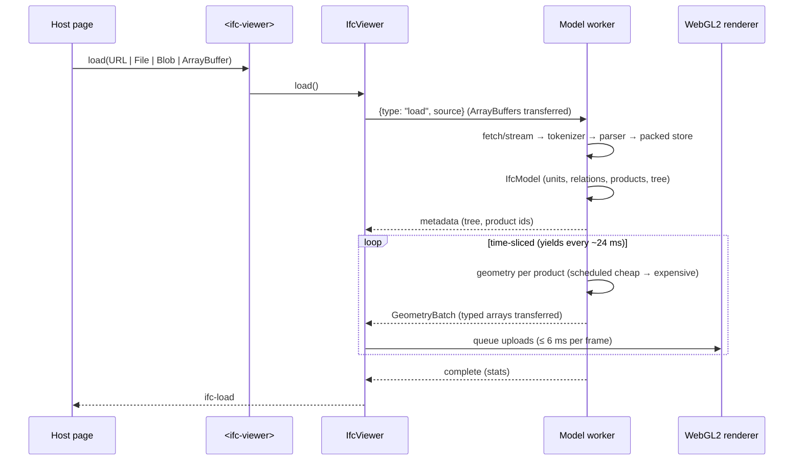

# Architecture

ifc-lens separates **format parsing**, **IFC semantics**, **geometry construction** and **rendering**. Each layer is a directory under `src/` with enforced import rules (`tests/unit/boundaries.test.ts`):

```
diagnostics ─┐
step ────────┼─► ifc ─► geometry ─► worker ─► (postMessage) ─► core ─► element
math, triangulation, csg ─┘              protocol ─┘      renderer ─┘
```

| Layer | Directory | Knows about | Never imports |
|---|---|---|---|
| STEP Part 21 | `src/step` | bytes, tokens, values | IFC, geometry |
| IFC model | `src/ifc` | entities, relations, units, properties, styles | geometry, rendering |
| Math / triangulation / CSG | `src/math`, `src/triangulation`, `src/csg` | Float64 geometry | IFC |
| Geometry | `src/geometry` | IFC representation items → renderer-neutral meshes | WebGL, DOM |
| Worker | `src/worker` | load session, sources, GPU packing | DOM |
| Renderer | `src/renderer` | WebGL2, camera, picking | IFC, STEP |
| Core viewer | `src/core` | worker client, selection/visibility/clipping state | the custom element |
| Element | `src/element` | Shadow DOM UI | worker internals |
| Iframe bridge | `src/iframe` | versioned postMessage protocol | |

## Load pipeline



## STEP parser (`src/step`)

- **Tokenizer**: a byte-level state machine. Every state survives chunk boundaries, and the tests split input at every byte position. Tokens contained in a chunk are read in place (zero copy); only tokens spanning chunks are buffered. Reals use the exact fast path (mantissa below 2^53, |exponent| ≤ 22) and fall back to `Number()` otherwise. Keywords are interned by byte hash.
- **String decoder**: handles doubled apostrophes, `\\`, `\S\`, `\P?\` code pages, `\X\`, `\X2\…\X0\` and `\X4\…\X0\`, plus raw UTF-8. Malformed escapes produce diagnostics without desynchronising the tokenizer.
- **Parser**: iterative, with a nesting counter and no recursion. It handles `HEADER`, one or more `DATA` sections (including edition-3 named sections), typed parameters and complex instances. Errors roll back the current instance and resynchronise at the next `;`. Duplicate ids keep the first definition.
- **Packed store**: values live in a pre-order arena (`Uint8Array` tags, `Int32Array` payloads, a `Float64Array` real pool, and aggregate count/size tables). References stay numeric ids and resolve lazily through a dense or hashed id index. Entity type names are interned and indexed by type with a counting sort. No JavaScript object is created per value unless explicitly materialised.

## IFC model (`src/ifc`)

- Schema family detection from `FILE_SCHEMA` (IFC2X3, IFC4, IFC4X3; unknown schemas decode with IFC4 layouts plus a diagnostic).
- Units from `IfcProject.UnitsInContext`: SI prefixes, conversion-based units (degrees, feet) and derived-unit symbols. Geometry is converted to metres once, in the product transform.
- Products are discovered structurally (GlobalId, ObjectPlacement, Representation), not from generated schema classes.
- Reverse relationship indexes are built once: aggregation, nesting, containment, properties, types, materials, classification, voids, fills and groups.
- Spatial tree: projects → decomposition/containment, openings under hosts, and a synthetic *Unassigned* node for everything unreachable.
- Properties are computed lazily per object: attributes, relations, property sets (single, enumerated, bounded, list, reference, table, complex), quantity sets, type properties, materials and classifications.
- Styles: `IfcStyledItem` surface colour and transparency, material colours via `IfcMaterialDefinitionRepresentation`, then per-type defaults.

## Geometry (`src/geometry`)

All construction is in Float64, in file units. The world transform is `unit scale × context WCS × object placement × item`, and mapped items add `target × inverse(origin)`.

- Placements: local placements (cached, cycle-checked), grid and linear placements (Cartesian fallback). Cartesian transformation operators are evaluated with mirroring (Axis2 orientation kept) and non-uniform scale.
- Curves: polyline, indexed poly-curve (line and 3-point arc segments), circle, ellipse, line, trimmed (by parameter in plane-angle units or by point, honouring sense), composite (incl. IFC4X3 line/circle curve segments), B-spline (rational, de Boor) and 2D offset. Arc segmentation is tolerance driven.
- Profiles are normalised (outer counter-clockwise, holes clockwise, duplicate and collinear vertices removed): parameterised shapes with fillets, arbitrary (with voids, open), centre-line, derived/mirrored and composite.
- Solids: extrusions along any direction (tapered with a matching topology), revolutions, directrix sweeps with mitred joints (fixed reference, surface-curve and rotation-minimising frames), swept disks (inner radius, fillets, closed loops, caps), CSG primitives and half-spaces (bounded to the other operand's domain).
- Tessellation and BReps: triangulated and polygonal face sets (one-based indices validated before use, `PnIndex`, per-face colour maps), faceted BReps with voids, shell- and face-based surface models, advanced BReps (planar exact, B-spline surfaces sampled), curve-bounded planes.
- Semantic openings: all `IfcRelVoidsElement` openings are transformed into the host frame and subtracted, grouped into disjoint batches.
- Instancing: representation maps used by at least two products become GPU-instanced definitions. Hosts with openings are baked.
- Scheduling: tessellated → mapped → extrusions → BReps → Booleans/openings → sweeps, so useful pixels appear first.
- Every failure is per item: decode errors, cycles and budget overruns become structured diagnostics and the sibling items still render.

## CSG (`src/csg`)

A project-owned mesh Boolean engine behind the `CsgBackend` interface, with explicit handle ownership:

1. Weld, drop degenerate triangles, and normalise coordinates around a shared origin.
2. Build a BVH over one operand and enumerate overlapping triangle pairs.
3. Compute exact triangle/triangle intersection segments (plane-interval overlap) plus coplanar overlaps (edges clipped to the other triangle).
4. Split each triangle by a planar arrangement: split edges at crossings and points, prune dangling edges, trace faces by half-edge walks, assign isolated loops as holes, and ear-clip the result. Edge points are shared across neighbouring triangles to avoid T-junctions.
5. Grow regions across non-intersection edges and classify each region once: coplanar regions by normal comparison, the rest by the generalised winding number, which stays meaningful for slightly open IFC shells.
6. Select fragments for union / intersection / difference, reverse the retained B fragments for A − B, weld, and stitch any remaining T-junctions.

The unit suite checks analytic volumes, watertightness (no boundary, non-manifold or inconsistent edges), operand order, touching and coplanar faces, curved and rotated cutters, and chained Booleans.

## Worker and protocol (`src/worker`, `src/protocol`)

`LoadSession` runs identically in the worker and in Node (the corpus suite uses it directly). It streams the source (fetch body, `Blob.stream()`, chunked buffers, ifcZIP via `DecompressionStream`), time-slices geometry, and yields to the event loop so `cancel` and property queries are served during a load. The packer bakes unique geometry into per-colour chunks (Float32 positions relative to a chunk origin, Int8 normals, per-vertex object index) and emits instanced definitions with Float32 matrices relative to the session render origin. All buffers are transferred.

## Renderer (`src/renderer`)

A focused WebGL2 renderer with no third-party code:

- **One instanced pipeline**: merged chunks draw as one instance (a translation to the chunk origin), and mapped definitions draw one instance per product.
- **Per-object state texture** (`R8UI`, indexed by object index): the hidden and selected flags are read in the vertex/fragment shader. Hide/isolate/select are therefore texture writes, never re-uploads, and highlighting works per instance.
- **GPU picking**: a 1×1 scissored pass into two `R32UI` attachments (object id and depth bits) gives the exact product and the world point. The world point drives orbit-around-cursor and zoom-to-cursor.
- **Clipping**: up to six planes, evaluated per fragment.
- **Culling and ordering**: frustum culling per chunk, two-sided lighting (IFC winding is not reliable), a polygon offset for lines, and back-to-front sorted transparency.
- **Budgets and recovery**: GPU uploads are time-budgeted per animation frame, and the model reloads after context loss and restore.

## Custom element (`src/element`)

Shadow DOM with CSS custom properties and `part`s. It provides a tool rail, an orientation cube (a CSS 3D cube synced to the camera each frame; its 6 faces × 3×3 regions cover all 26 standard views and are ordinary buttons, with faces turned away removed from the accessibility tree), an ARIA tree with roving tabindex and paged children, a property inspector (semantic tables), a section tool, a help panel in the bottom-right corner that documents the controls, an orbit-anchor marker (the picked pivot projected back to canvas pixels each frame), a status strip with a live region and progress bar, drag-and-drop, and keyboard shortcuts scoped to the focused canvas. Removing the element disposes it; moving it within the document does not.
